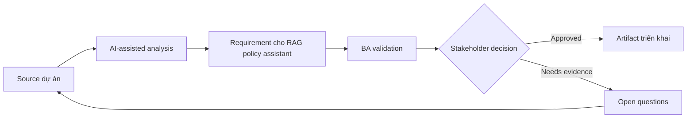

# Requirement cho RAG policy assistant

<div class="case-meta">
  <span>AI-enabled product use cases</span>
  <span>Knowledge assistant</span>
  <span>Use case dự án</span>
</div>

## Project context

HR muốn internal assistant trả lời câu hỏi policy của employee bằng approved documents. User gồm employee, manager và HR advisor, mỗi nhóm có access level và escalation path khác nhau. Trong Knowledge assistant, công việc này thường bắt đầu khi hành vi AI ảnh hưởng trực tiếp tới user và phải có uncertainty, fallback, evaluation và human review. BA nên xem Policy repository và Legacy handbook là evidence cần organize, không phải raw material để AI trả lời không kiểm soát. Mục tiêu là làm decision tiếp theo rõ hơn cho người own outcome.

## BA challenge

BA phải đặc tả RAG assistant vượt khỏi chatbot UX: source authority, freshness, permission, citation behavior, conflict handling, fallback, evaluation và operational ownership. Với Requirement cho RAG policy assistant, khó khăn thực tế là over-automation và confidence không an toàn. AI có thể tăng tốc AI task framing, output contract drafting, evaluation planning và safety-control critique, nhưng BA vẫn phải làm rõ assumption, approval còn thiếu và điểm cần stakeholder judgment.

## Where AI fits

<div class="ba-workbench-panel">
AI phù hợp với use case AI-enabled product khi được giới hạn vào AI task framing, output contract drafting, evaluation planning và safety-control critique. AI task hữu ích đầu tiên là: Inventory authoritative knowledge source và metadata need. AI không được approve scope, invent policy, bỏ qua approved source, model limit, evaluation case và human decision trigger, hoặc biến draft thành final decision.
</div>

- Inventory authoritative knowledge source và metadata need.
- Draft retrieval và answer requirement.
- Generate fallback scenario cho evidence yếu hoặc conflict.
- Tạo evaluation case cho retrieval quality và answer grounding.

## Inputs to prepare

- Policy repository
- Legacy handbook
- Role access rules
- HR escalation process
- Common employee questions

Trước khi prompt cho Requirement cho RAG policy assistant, hãy label từng input theo owner, date, approval status, sensitivity và vai trò trong decision. Evidence lens quan trọng nhất là approved source, model limit, evaluation case và human decision trigger; nếu thiếu, AI có thể xem old note, draft design và approved rule có authority như nhau.

## BA workflow

1. Define approved source, owner, effective date và access rule.
2. Yêu cầu AI draft knowledge contract và identify source conflict.
3. Specify answer behavior: citation, confidence, refusal và escalation.
4. Tạo evaluation question cho common, edge và conflict case.
5. Review privacy và access control với security và HR.
6. Publish requirement có retrieval metric và monitoring event.

Chạy workflow như AI operating contract trước khi build: bắt đầu với "Define approved source, owner, effective date và access rule.", sau đó giữ decision log visible khi artifact tiến tới Knowledge contract. Cách này ngăn suggestion của AI âm thầm trở thành backlog, design, release hoặc operational commitment.

## Diagram



## Deliverables

| Deliverable | Nội dung | Owner | Done signal |
| --- | --- | --- | --- |
| Knowledge contract | Source, owner, authority, freshness, metadata và access | BA và HR owner | Mọi source có authority status |
| RAG requirement set | Retrieval, citation, fallback, conflict và permission requirement | BA | Requirement cover retrieval và generation |
| Evaluation case set | Question, expected source, expected answer behavior và risk | QA và BA | Evaluation cover common và edge case |
| Operational playbook | Fallback, escalation, correction capture và monitoring | HR operations | Assistant có owner sau launch |

Hãy xem Knowledge contract là AI behavior specification do BA own. AI có thể draft structure, nhưng BA phải validate "Mọi source có authority status" có thật sự đúng không, artifact có trace được về evidence không và receiving team có hành động được không.

## Prompt to try

```text
Hãy đóng vai senior Business Analyst hiểu AI. Hỗ trợ tôi áp dụng use case "Requirement cho RAG policy assistant" vào dự án. Trước hết hỏi source evidence và constraint. Sau đó tạo structured analysis gồm project context, assumption, AI-fit boundary, workflow step, deliverable, risk, control, open question và stakeholder decision. Không tự bịa policy, threshold hoặc approval.
```

## Review checklist

- Policy repository được label owner, date, approval status và sensitivity.
- Knowledge contract trace được về source evidence và có human owner rõ.
- AI task nằm trong boundary AI task framing, output contract drafting, evaluation planning và safety-control critique và không approve scope hoặc policy.
- Risk "Stale policy" có control thực tế: Yêu cầu effective date metadata và source priority.
- Open assumption được chuyển thành validation question hoặc stakeholder decision.
- Success metric: Assistant chỉ trả lời từ trusted source, cite evidence, respect access và escalate an toàn.

## Risks and controls

| Rủi ro | Vì sao quan trọng | Control của BA |
| --- | --- | --- |
| Stale policy | Assistant có thể cite document cũ | Yêu cầu effective date metadata và source priority |
| Access leakage | Content manager-only có thể hiện cho employee | Permission-aware retrieval và security test |
| Citation theater | Answer có thể cite source không support claim | Evaluate claim-source support |
| No fallback | Assistant có thể invent khi evidence yếu | Yêu cầu refusal và escalation behavior |

Control chính cho risk "Stale policy" là human accountability explicit: Yêu cầu effective date metadata và source priority. Nếu evidence yếu, output nên tạo validation question hoặc decision item, không phải final requirement.
