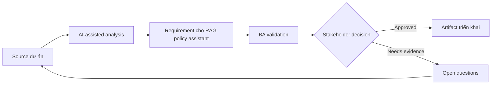

# Requirement cho RAG policy assistant

<div class="case-meta">
  <span>AI-enabled product use cases</span>
  <span>Knowledge assistant</span>
  <span>Use case dự án</span>
</div>

## Project context

HR muốn internal assistant trả lời câu hỏi policy của employee bằng approved documents. User gồm employee, manager và HR advisor, mỗi nhóm có access level và escalation path khác nhau. Trong môi trường delivery thật, tình huống này thường xuất hiện dưới áp lực thời gian: stakeholder cần clarity, delivery cần backlog, QA cần behavior test được, operations cần process chịu được exception. BA dùng AI để tăng tốc analysis và synthesis, nhưng BA vẫn chịu trách nhiệm về evidence, business meaning, stakeholder decisioning và artifact quality.

## BA challenge

BA phải đặc tả RAG assistant vượt khỏi chatbot UX: source authority, freshness, permission, citation behavior, conflict handling, fallback, evaluation và operational ownership. Khó khăn thực tế là AI có thể làm material ban đầu trông hoàn chỉnh hơn mức thật sự. BA giỏi giữ output ở trạng thái reviewable bằng cách tách source-backed fact, assumption, unsupported claim, decision gap và recommended next action. Mục tiêu không phải làm document dài hơn; mục tiêu là làm project decision rõ hơn và an toàn hơn.

## Where AI fits

<div class="ba-workbench-panel">
AI hữu ích trong use case này khi được giới hạn vào analysis support, pattern detection, structured drafting và critique. AI không được approve scope, invent policy, quyết định business trade-off hoặc thay thế judgment của stakeholder chịu trách nhiệm.
</div>

- Inventory authoritative knowledge source và metadata need.
- Draft retrieval và answer requirement.
- Generate fallback scenario cho evidence yếu hoặc conflict.
- Tạo evaluation case cho retrieval quality và answer grounding.

## Inputs to prepare

- Policy repository
- Legacy handbook
- Role access rules
- HR escalation process
- Common employee questions

BA nên label các input này trước khi dùng AI: source owner, source date, approval status, sensitivity level, và source đó là fact, opinion, policy, draft hay historical evidence. Việc chuẩn bị này ngăn model xem mọi input đều current và authoritative như nhau.

## BA workflow

1. Define approved source, owner, effective date và access rule.
2. Yêu cầu AI draft knowledge contract và identify source conflict.
3. Specify answer behavior: citation, confidence, refusal và escalation.
4. Tạo evaluation question cho common, edge và conflict case.
5. Review privacy và access control với security và HR.
6. Publish requirement có retrieval metric và monitoring event.

Workflow hiệu quả nhất khi dùng AI theo từng stage: trước hết organize evidence, sau đó yêu cầu analysis, tiếp theo tạo artifact, rồi chạy critique pass. BA nên giữ decision log visible xuyên suốt để suggestion do AI sinh ra không âm thầm trở thành approved scope.

## Diagram



## Deliverables

| Deliverable | Nội dung | Owner | Done signal |
| --- | --- | --- | --- |
| Knowledge contract | Source, owner, authority, freshness, metadata và access | BA và HR owner | Mọi source có authority status |
| RAG requirement set | Retrieval, citation, fallback, conflict và permission requirement | BA | Requirement cover retrieval và generation |
| Evaluation case set | Question, expected source, expected answer behavior và risk | QA và BA | Evaluation cover common và edge case |
| Operational playbook | Fallback, escalation, correction capture và monitoring | HR operations | Assistant có owner sau launch |

Các deliverable này nên được xem là artifact do BA own. AI có thể draft, nhưng BA phải validate source support, stakeholder meaning, traceability và artifact đã sẵn sàng handoff hay chưa.

## Prompt to try

```text
Hãy đóng vai senior Business Analyst hiểu AI. Hỗ trợ tôi áp dụng use case "Requirement cho RAG policy assistant" vào dự án. Trước hết hỏi source evidence và constraint. Sau đó tạo structured analysis gồm project context, assumption, AI-fit boundary, workflow step, deliverable, risk, control, open question và stakeholder decision. Không tự bịa policy, threshold hoặc approval.
```

## Review checklist

- Mọi statement do AI hỗ trợ đều gắn với source, assumption hoặc validation question.
- BA đã tách drafting assistance khỏi business approval.
- Workflow step có human owner cho decision, review và exception.
- Deliverable trace được về project input và review được bởi QA, product hoặc operations.
- Risk control đủ thực tế để dùng trong meeting dự án thật.
- Success metric: Assistant chỉ trả lời từ trusted source, cite evidence, respect access và escalate an toàn.

## Risks and controls

| Rủi ro | Vì sao quan trọng | Control của BA |
| --- | --- | --- |
| Stale policy | Assistant có thể cite document cũ | Yêu cầu effective date metadata và source priority |
| Access leakage | Content manager-only có thể hiện cho employee | Permission-aware retrieval và security test |
| Citation theater | Answer có thể cite source không support claim | Evaluate claim-source support |
| No fallback | Assistant có thể invent khi evidence yếu | Yêu cầu refusal và escalation behavior |

Control quan trọng nhất là làm uncertainty visible. Nếu evidence yếu, output nên tạo validation question hoặc decision item, không phải final requirement. Nếu artifact ảnh hưởng delivery, release, compliance, customer experience hoặc operational workload, BA nên yêu cầu human review explicit trước khi handoff.
