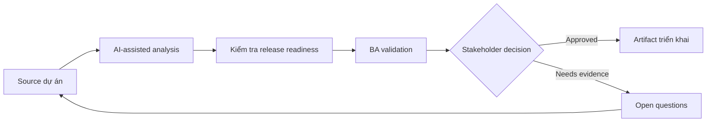

# Kiểm tra release readiness

<div class="case-meta">
  <span>Delivery and QA</span>
  <span>Release management</span>
  <span>Use case dự án</span>
</div>

## Project context

Một customer-facing release gần go-live. Development gần xong, nhưng vẫn có open defect, support process question chưa resolve, training note chưa đủ và uncertainty về rollback communication. Trong Release management, công việc này thường bắt đầu khi delivery decision, test evidence và release readiness phải còn nối với intent ban đầu. BA nên xem Release scope và Traceability matrix là evidence cần organize, không phải raw material để AI trả lời không kiểm soát. Mục tiêu là làm decision tiếp theo rõ hơn cho người own outcome.

## BA challenge

BA phải giúp tạo release readiness view tích hợp requirement, test result, defect, operational readiness, training, communication, rollback và business sign-off. AI có thể summarize status nhưng không được ra go-live decision. Với Kiểm tra release readiness, khó khăn thực tế là optimistic status và late requirement discovery. AI có thể tăng tốc scenario generation, defect triage support, readiness synthesis và risk surfacing, nhưng BA vẫn phải làm rõ assumption, approval còn thiếu và điểm cần stakeholder judgment.

## Where AI fits

<div class="ba-workbench-panel">
AI phù hợp với use case Delivery và QA khi được giới hạn vào scenario generation, defect triage support, readiness synthesis và risk surfacing. AI task hữu ích đầu tiên là: Summarize readiness evidence từ nhiều project artifact. AI không được approve scope, invent policy, bỏ qua requirement baseline, test result, defect history và release decision, hoặc biến draft thành final decision.
</div>

- Summarize readiness evidence từ nhiều project artifact.
- Identify missing operational, training và support readiness item.
- Tạo go-live risk summary và exception list.
- Draft sign-off question riêng cho stakeholder.

## Inputs to prepare

- Release scope
- Traceability matrix
- Test summary
- Defect list
- Operations và support readiness notes

Trước khi prompt cho Kiểm tra release readiness, hãy label từng input theo owner, date, approval status, sensitivity và vai trò trong decision. Evidence lens quan trọng nhất là requirement baseline, test result, defect history và release decision; nếu thiếu, AI có thể xem old note, draft design và approved rule có authority như nhau.

## BA workflow

1. Collect readiness evidence từ delivery, QA, support, operations và product.
2. Yêu cầu AI organize evidence theo readiness dimension.
3. Identify exception và classify theo go-live risk.
4. Verify defect và test status với QA và engineering.
5. Tạo decision option: go, go with exceptions, delay hoặc partial rollout.
6. Publish readiness brief cho sign-off meeting.

Chạy workflow như quality review trước release hoặc rework decision: bắt đầu với "Collect readiness evidence từ delivery, QA, support, operations và product.", sau đó giữ decision log visible khi artifact tiến tới Readiness dashboard. Cách này ngăn suggestion của AI âm thầm trở thành backlog, design, release hoặc operational commitment.

## Diagram



## Deliverables

| Deliverable | Nội dung | Owner | Done signal |
| --- | --- | --- | --- |
| Readiness dashboard | Scope, testing, defects, operations, training, communication và rollback status | BA | Mỗi dimension có status và owner |
| Exception register | Open issue, risk, decision needed, owner và due date | Project manager | Không exception nào thiếu decision path |
| Go-live decision brief | Option, risk, mitigation và recommendation | Product owner | Decision maker so sánh được trade-off |
| Support readiness checklist | Known issue, script, escalation và customer communication | Support lead | Support xử lý được launch question |

Hãy xem Readiness dashboard là QA và delivery handoff artifact do BA own. AI có thể draft structure, nhưng BA phải validate "Mỗi dimension có status và owner" có thật sự đúng không, artifact có trace được về evidence không và receiving team có hành động được không.

## Prompt to try

```text
Hãy đóng vai senior Business Analyst hiểu AI. Hỗ trợ tôi áp dụng use case "Kiểm tra release readiness" vào dự án. Trước hết hỏi source evidence và constraint. Sau đó tạo structured analysis gồm project context, assumption, AI-fit boundary, workflow step, deliverable, risk, control, open question và stakeholder decision. Không tự bịa policy, threshold hoặc approval.
```

## Review checklist

- Release scope được label owner, date, approval status và sensitivity.
- Readiness dashboard trace được về source evidence và có human owner rõ.
- AI task nằm trong boundary scenario generation, defect triage support, readiness synthesis và risk surfacing và không approve scope hoặc policy.
- Risk "Green status bias" có control thực tế: Yêu cầu source evidence và owner confirmation.
- Open assumption được chuyển thành validation question hoặc stakeholder decision.
- Success metric: Go-live meeting dùng readiness brief chung dựa trên evidence thay vì status update rời rạc.

## Risks and controls

| Rủi ro | Vì sao quan trọng | Control của BA |
| --- | --- | --- |
| Green status bias | Team có thể report optimistic status không có evidence | Yêu cầu source evidence và owner confirmation |
| Operational blind spot | Training và support có thể chưa xong dù code ready | Include non-technical readiness dimension |
| Exception ambiguity | Open issue có thể thiếu go-live decision | Assign decision owner và accepted-risk status |
| Rollback confusion | User có thể bị ảnh hưởng nếu rollback plan mơ hồ | Include rollback và communication requirement |

Control chính cho risk "Green status bias" là human accountability explicit: Yêu cầu source evidence và owner confirmation. Nếu evidence yếu, output nên tạo validation question hoặc decision item, không phải final requirement.
