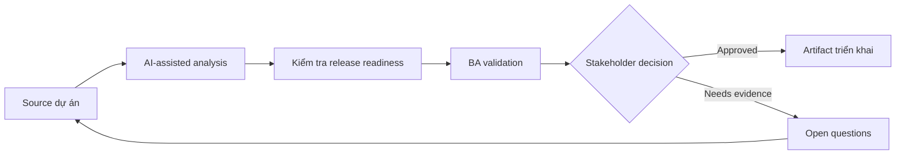

# Kiểm tra release readiness

<div class="case-meta">
  <span>Delivery and QA</span>
  <span>Release management</span>
  <span>Use case dự án</span>
</div>

## Project context

Một customer-facing release gần go-live. Development gần xong, nhưng vẫn có open defect, support process question chưa resolve, training note chưa đủ và uncertainty về rollback communication. Trong môi trường delivery thật, tình huống này thường xuất hiện dưới áp lực thời gian: stakeholder cần clarity, delivery cần backlog, QA cần behavior test được, operations cần process chịu được exception. BA dùng AI để tăng tốc analysis và synthesis, nhưng BA vẫn chịu trách nhiệm về evidence, business meaning, stakeholder decisioning và artifact quality.

## BA challenge

BA phải giúp tạo release readiness view tích hợp requirement, test result, defect, operational readiness, training, communication, rollback và business sign-off. AI có thể summarize status nhưng không được ra go-live decision. Khó khăn thực tế là AI có thể làm material ban đầu trông hoàn chỉnh hơn mức thật sự. BA giỏi giữ output ở trạng thái reviewable bằng cách tách source-backed fact, assumption, unsupported claim, decision gap và recommended next action. Mục tiêu không phải làm document dài hơn; mục tiêu là làm project decision rõ hơn và an toàn hơn.

## Where AI fits

<div class="ba-workbench-panel">
AI hữu ích trong use case này khi được giới hạn vào analysis support, pattern detection, structured drafting và critique. AI không được approve scope, invent policy, quyết định business trade-off hoặc thay thế judgment của stakeholder chịu trách nhiệm.
</div>

- Summarize readiness evidence từ nhiều project artifact.
- Identify missing operational, training và support readiness item.
- Tạo go-live risk summary và exception list.
- Draft sign-off question riêng cho stakeholder.

## Inputs to prepare

- Release scope
- Traceability matrix
- Test summary
- Defect list
- Operations và support readiness notes

BA nên label các input này trước khi dùng AI: source owner, source date, approval status, sensitivity level, và source đó là fact, opinion, policy, draft hay historical evidence. Việc chuẩn bị này ngăn model xem mọi input đều current và authoritative như nhau.

## BA workflow

1. Collect readiness evidence từ delivery, QA, support, operations và product.
2. Yêu cầu AI organize evidence theo readiness dimension.
3. Identify exception và classify theo go-live risk.
4. Verify defect và test status với QA và engineering.
5. Tạo decision option: go, go with exceptions, delay hoặc partial rollout.
6. Publish readiness brief cho sign-off meeting.

Workflow hiệu quả nhất khi dùng AI theo từng stage: trước hết organize evidence, sau đó yêu cầu analysis, tiếp theo tạo artifact, rồi chạy critique pass. BA nên giữ decision log visible xuyên suốt để suggestion do AI sinh ra không âm thầm trở thành approved scope.

## Diagram



## Deliverables

| Deliverable | Nội dung | Owner | Done signal |
| --- | --- | --- | --- |
| Readiness dashboard | Scope, testing, defects, operations, training, communication và rollback status | BA | Mỗi dimension có status và owner |
| Exception register | Open issue, risk, decision needed, owner và due date | Project manager | Không exception nào thiếu decision path |
| Go-live decision brief | Option, risk, mitigation và recommendation | Product owner | Decision maker so sánh được trade-off |
| Support readiness checklist | Known issue, script, escalation và customer communication | Support lead | Support xử lý được launch question |

Các deliverable này nên được xem là artifact do BA own. AI có thể draft, nhưng BA phải validate source support, stakeholder meaning, traceability và artifact đã sẵn sàng handoff hay chưa.

## Prompt to try

```text
Hãy đóng vai senior Business Analyst hiểu AI. Hỗ trợ tôi áp dụng use case "Kiểm tra release readiness" vào dự án. Trước hết hỏi source evidence và constraint. Sau đó tạo structured analysis gồm project context, assumption, AI-fit boundary, workflow step, deliverable, risk, control, open question và stakeholder decision. Không tự bịa policy, threshold hoặc approval.
```

## Review checklist

- Mọi statement do AI hỗ trợ đều gắn với source, assumption hoặc validation question.
- BA đã tách drafting assistance khỏi business approval.
- Workflow step có human owner cho decision, review và exception.
- Deliverable trace được về project input và review được bởi QA, product hoặc operations.
- Risk control đủ thực tế để dùng trong meeting dự án thật.
- Success metric: Go-live meeting dùng readiness brief chung dựa trên evidence thay vì status update rời rạc.

## Risks and controls

| Rủi ro | Vì sao quan trọng | Control của BA |
| --- | --- | --- |
| Green status bias | Team có thể report optimistic status không có evidence | Yêu cầu source evidence và owner confirmation |
| Operational blind spot | Training và support có thể chưa xong dù code ready | Include non-technical readiness dimension |
| Exception ambiguity | Open issue có thể thiếu go-live decision | Assign decision owner và accepted-risk status |
| Rollback confusion | User có thể bị ảnh hưởng nếu rollback plan mơ hồ | Include rollback và communication requirement |

Control quan trọng nhất là làm uncertainty visible. Nếu evidence yếu, output nên tạo validation question hoặc decision item, không phải final requirement. Nếu artifact ảnh hưởng delivery, release, compliance, customer experience hoặc operational workload, BA nên yêu cầu human review explicit trước khi handoff.
