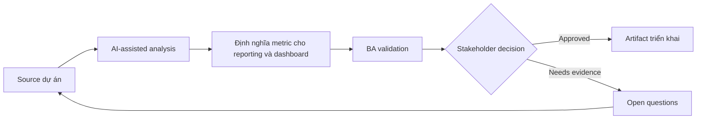

# Định nghĩa metric cho reporting và dashboard

<div class="case-meta">
  <span>Data and Integration</span>
  <span>Reporting</span>
  <span>Use case dự án</span>
</div>

## Project context

Leadership muốn dashboard cho onboarding cycle time, conversion, support contact rate và document rejection reason. Các team chưa thống nhất metric definition và data source. Trong môi trường delivery thật, tình huống này thường xuất hiện dưới áp lực thời gian: stakeholder cần clarity, delivery cần backlog, QA cần behavior test được, operations cần process chịu được exception. BA dùng AI để tăng tốc analysis và synthesis, nhưng BA vẫn chịu trách nhiệm về evidence, business meaning, stakeholder decisioning và artifact quality.

## BA challenge

BA phải define metric để dashboard không tạo false decision. Mỗi metric cần definition, denominator, numerator, filter, data source, freshness, owner và known limitation. Khó khăn thực tế là AI có thể làm material ban đầu trông hoàn chỉnh hơn mức thật sự. BA giỏi giữ output ở trạng thái reviewable bằng cách tách source-backed fact, assumption, unsupported claim, decision gap và recommended next action. Mục tiêu không phải làm document dài hơn; mục tiêu là làm project decision rõ hơn và an toàn hơn.

## Where AI fits

<div class="ba-workbench-panel">
AI hữu ích trong use case này khi được giới hạn vào analysis support, pattern detection, structured drafting và critique. AI không được approve scope, invent policy, quyết định business trade-off hoặc thay thế judgment của stakeholder chịu trách nhiệm.
</div>

- Draft metric definition table từ business question.
- Identify numerator, denominator và filter logic ambiguous.
- Generate dashboard acceptance criteria và data quality check.
- Tạo stakeholder question cho metric ownership.

## Inputs to prepare

- Business questions
- Data source list
- Event taxonomy
- Current reports
- Stakeholder decisions

BA nên label các input này trước khi dùng AI: source owner, source date, approval status, sensitivity level, và source đó là fact, opinion, policy, draft hay historical evidence. Việc chuẩn bị này ngăn model xem mọi input đều current và authoritative như nhau.

## BA workflow

1. Bắt đầu từ decision dashboard cần support.
2. Yêu cầu AI draft metric definition và ambiguity question.
3. Define numerator, denominator, filter, grain, freshness và owner.
4. Validate data source availability và quality với data team.
5. Tạo acceptance criteria cho calculation và display behavior.
6. Thêm caveat và known limitation vào dashboard requirement.

Workflow hiệu quả nhất khi dùng AI theo từng stage: trước hết organize evidence, sau đó yêu cầu analysis, tiếp theo tạo artifact, rồi chạy critique pass. BA nên giữ decision log visible xuyên suốt để suggestion do AI sinh ra không âm thầm trở thành approved scope.

## Diagram



## Deliverables

| Deliverable | Nội dung | Owner | Done signal |
| --- | --- | --- | --- |
| Metric definition catalog | Metric, purpose, numerator, denominator, filter, grain, source và owner | BA và data owner | Metric unambiguous |
| Dashboard requirement spec | Visualization, interaction, filter, export và access behavior | BA và product | Dashboard behavior testable |
| Data quality checklist | Completeness, freshness, reconciliation và known limitation | Data team | Quality risk visible |
| Decision-use map | Metric tới decision, stakeholder và action threshold | Product owner | Dashboard support decision |

Các deliverable này nên được xem là artifact do BA own. AI có thể draft, nhưng BA phải validate source support, stakeholder meaning, traceability và artifact đã sẵn sàng handoff hay chưa.

## Prompt to try

```text
Hãy đóng vai senior Business Analyst hiểu AI. Hỗ trợ tôi áp dụng use case "Định nghĩa metric cho reporting và dashboard" vào dự án. Trước hết hỏi source evidence và constraint. Sau đó tạo structured analysis gồm project context, assumption, AI-fit boundary, workflow step, deliverable, risk, control, open question và stakeholder decision. Không tự bịa policy, threshold hoặc approval.
```

## Review checklist

- Mọi statement do AI hỗ trợ đều gắn với source, assumption hoặc validation question.
- BA đã tách drafting assistance khỏi business approval.
- Workflow step có human owner cho decision, review và exception.
- Deliverable trace được về project input và review được bởi QA, product hoặc operations.
- Risk control đủ thực tế để dùng trong meeting dự án thật.
- Success metric: Dashboard metric trở nên decision-ready vì definition, source và limitation explicit.

## Risks and controls

| Rủi ro | Vì sao quan trọng | Control của BA |
| --- | --- | --- |
| Metric ambiguity | Team khác nhau calculate cùng metric khác nhau | Define numerator, denominator, filter và grain |
| False precision | Dashboard nhìn accurate dù data quality kém | Show caveat và quality check |
| Decision disconnect | Metric không support action nào | Map metric tới decision |
| Stale data | Leader action trên data cũ | Define freshness và update time |

Control quan trọng nhất là làm uncertainty visible. Nếu evidence yếu, output nên tạo validation question hoặc decision item, không phải final requirement. Nếu artifact ảnh hưởng delivery, release, compliance, customer experience hoặc operational workload, BA nên yêu cầu human review explicit trước khi handoff.
