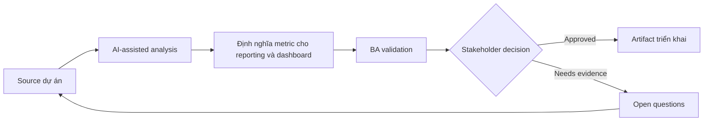

# Định nghĩa metric cho reporting và dashboard

<div class="case-meta">
  <span>Data and Integration</span>
  <span>Reporting</span>
  <span>Data and integration</span>
  <span>Advanced</span>
  <span>Metric definition catalog</span>
  <span>Use case dự án</span>
</div>

## Project context

Leadership muốn dashboard cho onboarding cycle time, conversion, support contact rate và document rejection reason. Các team chưa thống nhất metric definition và data source. Trong Reporting, công việc này thường bắt đầu khi data movement, mapping, reconciliation, privacy và lineage decision ảnh hưởng nhiều system và owner. BA nên xem Business questions và Data source list là evidence cần organize, không phải raw material để AI trả lời không kiểm soát. Mục tiêu là làm decision tiếp theo rõ hơn cho người own outcome.

## BA challenge

BA phải define metric để dashboard không tạo false decision. Mỗi metric cần definition, denominator, numerator, filter, data source, freshness, owner và known limitation. Với Định nghĩa metric cho reporting và dashboard, khó khăn thực tế là silent data loss và lineage yếu. AI có thể tăng tốc field mapping, rule comparison, reconciliation design, lineage review và exception analysis, nhưng BA vẫn phải làm rõ assumption, approval còn thiếu và điểm cần stakeholder judgment.

## Where AI fits

<div class="ba-workbench-panel">
AI phù hợp với use case Data và Integration khi được giới hạn vào field mapping, rule comparison, reconciliation design, lineage review và exception analysis. AI task hữu ích đầu tiên là: Draft metric definition table từ business question. AI không được approve scope, invent policy, bỏ qua source schema, sample payload, mapping rule, data-quality report và ownership matrix, hoặc biến draft thành final decision.
</div>

- Draft metric definition table từ business question.
- Identify numerator, denominator và filter logic ambiguous.
- Generate dashboard acceptance criteria và data quality check.
- Tạo stakeholder question cho metric ownership.

## Inputs to prepare

- Business questions
- Data source list
- Event taxonomy
- Current reports
- Stakeholder decisions

Trước khi prompt cho Định nghĩa metric cho reporting và dashboard, hãy label từng input theo owner, date, approval status, sensitivity và vai trò trong decision. Evidence lens quan trọng nhất là source schema, sample payload, mapping rule, data-quality report và ownership matrix; nếu thiếu, AI có thể xem old note, draft design và approved rule có authority như nhau.

## BA workflow

1. Bắt đầu từ decision dashboard cần support.
2. Yêu cầu AI draft metric definition và ambiguity question.
3. Define numerator, denominator, filter, grain, freshness và owner.
4. Validate data source availability và quality với data team.
5. Tạo acceptance criteria cho calculation và display behavior.
6. Thêm caveat và known limitation vào dashboard requirement.

Chạy workflow như data contract review trước integration build: bắt đầu với "Bắt đầu từ decision dashboard cần support.", sau đó giữ decision log visible khi artifact tiến tới Metric definition catalog. Cách này ngăn suggestion của AI âm thầm trở thành backlog, design, release hoặc operational commitment.

## Diagram



## Deliverables

| Deliverable | Nội dung | Owner | Done signal |
| --- | --- | --- | --- |
| Metric definition catalog | Metric, purpose, numerator, denominator, filter, grain, source và owner | BA và data owner | Metric unambiguous |
| Dashboard requirement spec | Visualization, interaction, filter, export và access behavior | BA và product | Dashboard behavior testable |
| Data quality checklist | Completeness, freshness, reconciliation và known limitation | Data team | Quality risk visible |
| Decision-use map | Metric tới decision, stakeholder và action threshold | Product owner | Dashboard support decision |

Hãy xem Metric definition catalog là data and integration control pack do BA own. AI có thể draft structure, nhưng BA phải validate "Metric unambiguous" có thật sự đúng không, artifact có trace được về evidence không và receiving team có hành động được không.

## Prompt to try

```text
Hãy đóng vai senior Business Analyst hiểu AI. Hỗ trợ tôi áp dụng use case "Định nghĩa metric cho reporting và dashboard" vào dự án. Trước hết hỏi source evidence và constraint. Sau đó tạo structured analysis gồm project context, assumption, AI-fit boundary, workflow step, deliverable, risk, control, open question và stakeholder decision. Không tự bịa policy, threshold hoặc approval.
```

## Review checklist

- Business questions được label owner, date, approval status và sensitivity.
- Metric definition catalog trace được về source evidence và có human owner rõ.
- AI task nằm trong boundary field mapping, rule comparison, reconciliation design, lineage review và exception analysis và không approve scope hoặc policy.
- Risk "Metric ambiguity" có control thực tế: Define numerator, denominator, filter và grain.
- Open assumption được chuyển thành validation question hoặc stakeholder decision.
- Success metric: Dashboard metric trở nên decision-ready vì definition, source và limitation explicit.

## Risks and controls

| Rủi ro | Vì sao quan trọng | Control của BA |
| --- | --- | --- |
| Metric ambiguity | Team khác nhau calculate cùng metric khác nhau | Define numerator, denominator, filter và grain |
| False precision | Dashboard nhìn accurate dù data quality kém | Show caveat và quality check |
| Decision disconnect | Metric không support action nào | Map metric tới decision |
| Stale data | Leader action trên data cũ | Define freshness và update time |

Control chính cho risk "Metric ambiguity" là human accountability explicit: Define numerator, denominator, filter và grain. Nếu evidence yếu, output nên tạo validation question hoặc decision item, không phải final requirement.
