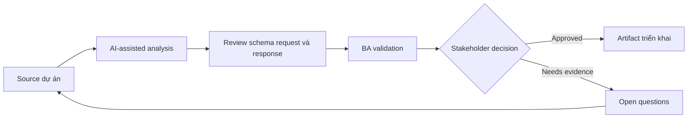

# Review schema request và response

<div class="case-meta">
  <span>Backend and API</span>
  <span>Schema design</span>
  <span>Use case dự án</span>
</div>

## Project context

Backend team draft request và response schema cho partner onboarding API. Product stakeholder không biết optional field, null value, nested object và identifier có match business rule không. Trong Schema design, công việc này thường bắt đầu khi API contract, permission, error, audit và operational behavior phải đủ explicit cho backend delivery. BA nên xem OpenAPI draft và Business glossary là evidence cần organize, không phải raw material để AI trả lời không kiểm soát. Mục tiêu là làm decision tiếp theo rõ hơn cho người own outcome.

## BA challenge

BA phải review schema semantics với business owner. Mục tiêu là đảm bảo field, nullability, default, enum, ID và nested structure represent đúng business concept và lifecycle state. Với Review schema request và response, khó khăn thực tế là service behavior mơ hồ và security gap. AI có thể tăng tốc contract critique, rule extraction, error taxonomy, permission review và NFR gap detection, nhưng BA vẫn phải làm rõ assumption, approval còn thiếu và điểm cần stakeholder judgment.

## Where AI fits

<div class="ba-workbench-panel">
AI phù hợp với use case Backend và API khi được giới hạn vào contract critique, rule extraction, error taxonomy, permission review và NFR gap detection. AI task hữu ích đầu tiên là: Explain schema field bằng business language. AI không được approve scope, invent policy, bỏ qua API draft, data model, auth rule, error sample, audit policy và integration need, hoặc biến draft thành final decision.
</div>

- Explain schema field bằng business language.
- Identify nullability, enum và nested object rule chưa rõ.
- Generate business question cho schema review.
- Draft schema example cho common và edge scenario.

## Inputs to prepare

- OpenAPI draft
- Business glossary
- Entity lifecycle
- Validation policy
- Example payloads

Trước khi prompt cho Review schema request và response, hãy label từng input theo owner, date, approval status, sensitivity và vai trò trong decision. Evidence lens quan trọng nhất là API draft, data model, auth rule, error sample, audit policy và integration need; nếu thiếu, AI có thể xem old note, draft design và approved rule có authority như nhau.

## BA workflow

1. Load schema field vào field review table.
2. Yêu cầu AI translate technical schema thành business meaning.
3. Identify field thiếu source rule, optionality chưa rõ hoặc enum ambiguous.
4. Tạo example payload cho common, boundary và invalid case.
5. Review với backend, product, QA và data owner.
6. Update schema decision và validation requirement.

Chạy workflow như contract validation trước implementation: bắt đầu với "Load schema field vào field review table.", sau đó giữ decision log visible khi artifact tiến tới Schema review table. Cách này ngăn suggestion của AI âm thầm trở thành backlog, design, release hoặc operational commitment.

## Diagram



## Deliverables

| Deliverable | Nội dung | Owner | Done signal |
| --- | --- | --- | --- |
| Schema review table | Field, meaning, required status, nullability, enum, default và source rule | BA | Business owner review được schema |
| Payload examples | Common, edge, invalid và backwards-compatible example | Backend và QA | Example cover scenario thật |
| Schema question log | Ambiguity, decision owner, option và resolution | BA | Field unclear được resolve |
| Validation alignment matrix | Schema rule, business rule, API validation và UI validation | BA và QA | Validation consistent |

Hãy xem Schema review table là backend behavior contract do BA own. AI có thể draft structure, nhưng BA phải validate "Business owner review được schema" có thật sự đúng không, artifact có trace được về evidence không và receiving team có hành động được không.

## Prompt to try

```text
Hãy đóng vai senior Business Analyst hiểu AI. Hỗ trợ tôi áp dụng use case "Review schema request và response" vào dự án. Trước hết hỏi source evidence và constraint. Sau đó tạo structured analysis gồm project context, assumption, AI-fit boundary, workflow step, deliverable, risk, control, open question và stakeholder decision. Không tự bịa policy, threshold hoặc approval.
```

## Review checklist

- OpenAPI draft được label owner, date, approval status và sensitivity.
- Schema review table trace được về source evidence và có human owner rõ.
- AI task nằm trong boundary contract critique, rule extraction, error taxonomy, permission review và NFR gap detection và không approve scope hoặc policy.
- Risk "Optionality confusion" có control thực tế: Define nullability và absence semantics.
- Open assumption được chuyển thành validation question hoặc stakeholder decision.
- Success metric: API schema field dễ hiểu, testable và aligned với business concept.

## Risks and controls

| Rủi ro | Vì sao quan trọng | Control của BA |
| --- | --- | --- |
| Optionality confusion | Null và omitted value có thể mang business state khác nhau | Define nullability và absence semantics |
| Enum drift | Enum value có thể không match business language | Review enum label và lifecycle state |
| Identifier ambiguity | ID có thể bị dùng sai giữa system | Define ID source và uniqueness |
| Example shortage | Team không test được schema edge case | Tạo payload example |

Control chính cho risk "Optionality confusion" là human accountability explicit: Define nullability và absence semantics. Nếu evidence yếu, output nên tạo validation question hoặc decision item, không phải final requirement.
