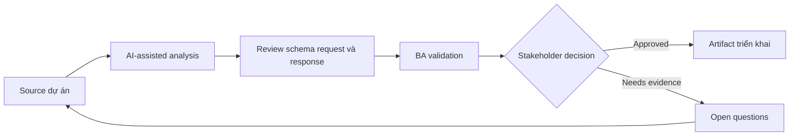

# Review schema request và response

<div class="case-meta">
  <span>Backend and API</span>
  <span>Schema design</span>
  <span>Use case dự án</span>
</div>

## Project context

Backend team draft request và response schema cho partner onboarding API. Product stakeholder không biết optional field, null value, nested object và identifier có match business rule không. Trong môi trường delivery thật, tình huống này thường xuất hiện dưới áp lực thời gian: stakeholder cần clarity, delivery cần backlog, QA cần behavior test được, operations cần process chịu được exception. BA dùng AI để tăng tốc analysis và synthesis, nhưng BA vẫn chịu trách nhiệm về evidence, business meaning, stakeholder decisioning và artifact quality.

## BA challenge

BA phải review schema semantics với business owner. Mục tiêu là đảm bảo field, nullability, default, enum, ID và nested structure represent đúng business concept và lifecycle state. Khó khăn thực tế là AI có thể làm material ban đầu trông hoàn chỉnh hơn mức thật sự. BA giỏi giữ output ở trạng thái reviewable bằng cách tách source-backed fact, assumption, unsupported claim, decision gap và recommended next action. Mục tiêu không phải làm document dài hơn; mục tiêu là làm project decision rõ hơn và an toàn hơn.

## Where AI fits

<div class="ba-workbench-panel">
AI hữu ích trong use case này khi được giới hạn vào analysis support, pattern detection, structured drafting và critique. AI không được approve scope, invent policy, quyết định business trade-off hoặc thay thế judgment của stakeholder chịu trách nhiệm.
</div>

- Explain schema field bằng business language.
- Identify nullability, enum và nested object rule chưa rõ.
- Generate business question cho schema review.
- Draft schema example cho common và edge scenario.

## Inputs to prepare

- OpenAPI draft
- Business glossary
- Entity lifecycle
- Validation policy
- Example payloads

BA nên label các input này trước khi dùng AI: source owner, source date, approval status, sensitivity level, và source đó là fact, opinion, policy, draft hay historical evidence. Việc chuẩn bị này ngăn model xem mọi input đều current và authoritative như nhau.

## BA workflow

1. Load schema field vào field review table.
2. Yêu cầu AI translate technical schema thành business meaning.
3. Identify field thiếu source rule, optionality chưa rõ hoặc enum ambiguous.
4. Tạo example payload cho common, boundary và invalid case.
5. Review với backend, product, QA và data owner.
6. Update schema decision và validation requirement.

Workflow hiệu quả nhất khi dùng AI theo từng stage: trước hết organize evidence, sau đó yêu cầu analysis, tiếp theo tạo artifact, rồi chạy critique pass. BA nên giữ decision log visible xuyên suốt để suggestion do AI sinh ra không âm thầm trở thành approved scope.

## Diagram



## Deliverables

| Deliverable | Nội dung | Owner | Done signal |
| --- | --- | --- | --- |
| Schema review table | Field, meaning, required status, nullability, enum, default và source rule | BA | Business owner review được schema |
| Payload examples | Common, edge, invalid và backwards-compatible example | Backend và QA | Example cover scenario thật |
| Schema question log | Ambiguity, decision owner, option và resolution | BA | Field unclear được resolve |
| Validation alignment matrix | Schema rule, business rule, API validation và UI validation | BA và QA | Validation consistent |

Các deliverable này nên được xem là artifact do BA own. AI có thể draft, nhưng BA phải validate source support, stakeholder meaning, traceability và artifact đã sẵn sàng handoff hay chưa.

## Prompt to try

```text
Hãy đóng vai senior Business Analyst hiểu AI. Hỗ trợ tôi áp dụng use case "Review schema request và response" vào dự án. Trước hết hỏi source evidence và constraint. Sau đó tạo structured analysis gồm project context, assumption, AI-fit boundary, workflow step, deliverable, risk, control, open question và stakeholder decision. Không tự bịa policy, threshold hoặc approval.
```

## Review checklist

- Mọi statement do AI hỗ trợ đều gắn với source, assumption hoặc validation question.
- BA đã tách drafting assistance khỏi business approval.
- Workflow step có human owner cho decision, review và exception.
- Deliverable trace được về project input và review được bởi QA, product hoặc operations.
- Risk control đủ thực tế để dùng trong meeting dự án thật.
- Success metric: API schema field dễ hiểu, testable và aligned với business concept.

## Risks and controls

| Rủi ro | Vì sao quan trọng | Control của BA |
| --- | --- | --- |
| Optionality confusion | Null và omitted value có thể mang business state khác nhau | Define nullability và absence semantics |
| Enum drift | Enum value có thể không match business language | Review enum label và lifecycle state |
| Identifier ambiguity | ID có thể bị dùng sai giữa system | Define ID source và uniqueness |
| Example shortage | Team không test được schema edge case | Tạo payload example |

Control quan trọng nhất là làm uncertainty visible. Nếu evidence yếu, output nên tạo validation question hoặc decision item, không phải final requirement. Nếu artifact ảnh hưởng delivery, release, compliance, customer experience hoặc operational workload, BA nên yêu cầu human review explicit trước khi handoff.
