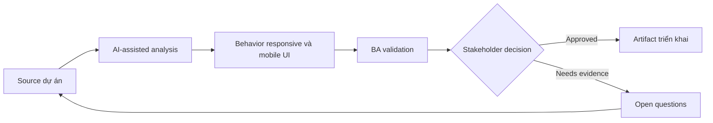

# Behavior responsive và mobile UI

<div class="case-meta">
  <span>Frontend, UI, and UX</span>
  <span>Responsive design</span>
  <span>Use case dự án</span>
</div>

## Project context

Admin workflow desktop-first cũng phải hoạt động trên tablet và mobile cho field operations. Design có desktop screen, nhưng mobile breakpoint, content priority và touch interaction chưa rõ. Trong môi trường delivery thật, tình huống này thường xuất hiện dưới áp lực thời gian: stakeholder cần clarity, delivery cần backlog, QA cần behavior test được, operations cần process chịu được exception. BA dùng AI để tăng tốc analysis và synthesis, nhưng BA vẫn chịu trách nhiệm về evidence, business meaning, stakeholder decisioning và artifact quality.

## BA challenge

BA phải đặc tả responsive behavior như requirement, không để thành cách hiểu CSS. BA cần define content priority, hidden/collapsed controls, mobile action pattern, table behavior và acceptance criteria theo viewport. Khó khăn thực tế là AI có thể làm material ban đầu trông hoàn chỉnh hơn mức thật sự. BA giỏi giữ output ở trạng thái reviewable bằng cách tách source-backed fact, assumption, unsupported claim, decision gap và recommended next action. Mục tiêu không phải làm document dài hơn; mục tiêu là làm project decision rõ hơn và an toàn hơn.

## Where AI fits

<div class="ba-workbench-panel">
AI hữu ích trong use case này khi được giới hạn vào analysis support, pattern detection, structured drafting và critique. AI không được approve scope, invent policy, quyết định business trade-off hoặc thay thế judgment của stakeholder chịu trách nhiệm.
</div>

- Generate responsive behavior question từ desktop design.
- Draft content priority và mobile state matrix.
- Identify component risky như table, filter, modal và bulk action.
- Tạo acceptance criteria theo viewport.

## Inputs to prepare

- Desktop design
- Target device list
- User journey
- Component library rules
- Usage analytics

BA nên label các input này trước khi dùng AI: source owner, source date, approval status, sensitivity level, và source đó là fact, opinion, policy, draft hay historical evidence. Việc chuẩn bị này ngăn model xem mọi input đều current và authoritative như nhau.

## BA workflow

1. Confirm target device, breakpoint và primary mobile task.
2. Yêu cầu AI identify element dễ fail trên small screen.
3. Define content priority, stacking order, collapsed control và table behavior.
4. Review touch, keyboard và accessibility implication.
5. Viết acceptance criteria theo viewport và role.
6. Thêm QA checklist cho real device và browser combination.

Workflow hiệu quả nhất khi dùng AI theo từng stage: trước hết organize evidence, sau đó yêu cầu analysis, tiếp theo tạo artifact, rồi chạy critique pass. BA nên giữ decision log visible xuyên suốt để suggestion do AI sinh ra không âm thầm trở thành approved scope.

## Diagram



## Deliverables

| Deliverable | Nội dung | Owner | Done signal |
| --- | --- | --- | --- |
| Responsive behavior matrix | Viewport, content priority, layout, control behavior và exception | BA và UX | Breakpoint có rule |
| Mobile task checklist | Critical task, device, interaction và acceptance signal | Product owner | Mobile task viable |
| Component risk list | Table, modal, filter, bulk action và overflow risk | Frontend | Risky component được design |
| Viewport QA plan | Desktop, tablet, mobile, keyboard và touch scenario | QA | Responsive behavior được test |

Các deliverable này nên được xem là artifact do BA own. AI có thể draft, nhưng BA phải validate source support, stakeholder meaning, traceability và artifact đã sẵn sàng handoff hay chưa.

## Prompt to try

```text
Hãy đóng vai senior Business Analyst hiểu AI. Hỗ trợ tôi áp dụng use case "Behavior responsive và mobile UI" vào dự án. Trước hết hỏi source evidence và constraint. Sau đó tạo structured analysis gồm project context, assumption, AI-fit boundary, workflow step, deliverable, risk, control, open question và stakeholder decision. Không tự bịa policy, threshold hoặc approval.
```

## Review checklist

- Mọi statement do AI hỗ trợ đều gắn với source, assumption hoặc validation question.
- BA đã tách drafting assistance khỏi business approval.
- Workflow step có human owner cho decision, review và exception.
- Deliverable trace được về project input và review được bởi QA, product hoặc operations.
- Risk control đủ thực tế để dùng trong meeting dự án thật.
- Success metric: Responsive UI behavior đủ explicit để design, frontend và QA validate qua nhiều device.

## Risks and controls

| Rủi ro | Vì sao quan trọng | Control của BA |
| --- | --- | --- |
| Desktop assumption | Mobile user có thể không hoàn thành critical task | Define mobile task coverage |
| Table overflow | Important data có thể biến mất hoặc unusable | Specify table collapse hoặc horizontal behavior |
| Hidden actions | Collapsed control có thể hide required action | Define priority và discoverability |
| Device testing gap | Browser simulation có thể miss real device issue | Thêm real-device QA scenario |

Control quan trọng nhất là làm uncertainty visible. Nếu evidence yếu, output nên tạo validation question hoặc decision item, không phải final requirement. Nếu artifact ảnh hưởng delivery, release, compliance, customer experience hoặc operational workload, BA nên yêu cầu human review explicit trước khi handoff.
