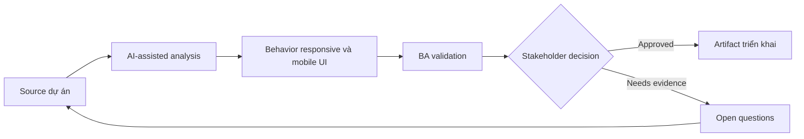

# Behavior responsive và mobile UI

<div class="case-meta">
  <span>Frontend, UI, and UX</span>
  <span>Responsive design</span>
  <span>Frontend/UI refinement</span>
  <span>Practitioner</span>
  <span>Responsive behavior matrix</span>
  <span>Use case dự án</span>
</div>

## Project context

Admin workflow desktop-first cũng phải hoạt động trên tablet và mobile cho field operations. Design có desktop screen, nhưng mobile breakpoint, content priority và touch interaction chưa rõ. Trong Responsive design, công việc này thường bắt đầu khi screen behavior, accessibility, design state, analytics và user feedback phải thành requirement implement được. BA nên xem Desktop design và Target device list là evidence cần organize, không phải raw material để AI trả lời không kiểm soát. Mục tiêu là làm decision tiếp theo rõ hơn cho người own outcome.

## BA challenge

BA phải đặc tả responsive behavior như requirement, không để thành cách hiểu CSS. BA cần define content priority, hidden/collapsed controls, mobile action pattern, table behavior và acceptance criteria theo viewport. Với Behavior responsive và mobile UI, khó khăn thực tế là missing state và UX không đo được. AI có thể tăng tốc UI-state analysis, content critique, accessibility review, event taxonomy và edge-case discovery, nhưng BA vẫn phải làm rõ assumption, approval còn thiếu và điểm cần stakeholder judgment.

## Where AI fits

<div class="ba-workbench-panel">
AI phù hợp với use case Frontend, UI và UX khi được giới hạn vào UI-state analysis, content critique, accessibility review, event taxonomy và edge-case discovery. AI task hữu ích đầu tiên là: Generate responsive behavior question từ desktop design. AI không được approve scope, invent policy, bỏ qua wireframe, design token, user journey, analytics question và accessibility expectation, hoặc biến draft thành final decision.
</div>

- Generate responsive behavior question từ desktop design.
- Draft content priority và mobile state matrix.
- Identify component risky như table, filter, modal và bulk action.
- Tạo acceptance criteria theo viewport.

## Inputs to prepare

- Desktop design
- Target device list
- User journey
- Component library rules
- Usage analytics

Trước khi prompt cho Behavior responsive và mobile UI, hãy label từng input theo owner, date, approval status, sensitivity và vai trò trong decision. Evidence lens quan trọng nhất là wireframe, design token, user journey, analytics question và accessibility expectation; nếu thiếu, AI có thể xem old note, draft design và approved rule có authority như nhau.

## BA workflow

1. Confirm target device, breakpoint và primary mobile task.
2. Yêu cầu AI identify element dễ fail trên small screen.
3. Define content priority, stacking order, collapsed control và table behavior.
4. Review touch, keyboard và accessibility implication.
5. Viết acceptance criteria theo viewport và role.
6. Thêm QA checklist cho real device và browser combination.

Chạy workflow như screen-state review trước frontend build: bắt đầu với "Confirm target device, breakpoint và primary mobile task.", sau đó giữ decision log visible khi artifact tiến tới Responsive behavior matrix. Cách này ngăn suggestion của AI âm thầm trở thành backlog, design, release hoặc operational commitment.

## Diagram



## Deliverables

| Deliverable | Nội dung | Owner | Done signal |
| --- | --- | --- | --- |
| Responsive behavior matrix | Viewport, content priority, layout, control behavior và exception | BA và UX | Breakpoint có rule |
| Mobile task checklist | Critical task, device, interaction và acceptance signal | Product owner | Mobile task viable |
| Component risk list | Table, modal, filter, bulk action và overflow risk | Frontend | Risky component được design |
| Viewport QA plan | Desktop, tablet, mobile, keyboard và touch scenario | QA | Responsive behavior được test |

Hãy xem Responsive behavior matrix là frontend requirement specification do BA own. AI có thể draft structure, nhưng BA phải validate "Breakpoint có rule" có thật sự đúng không, artifact có trace được về evidence không và receiving team có hành động được không.

## Prompt to try

```text
Hãy đóng vai senior Business Analyst hiểu AI. Hỗ trợ tôi áp dụng use case "Behavior responsive và mobile UI" vào dự án. Trước hết hỏi source evidence và constraint. Sau đó tạo structured analysis gồm project context, assumption, AI-fit boundary, workflow step, deliverable, risk, control, open question và stakeholder decision. Không tự bịa policy, threshold hoặc approval.
```

## Review checklist

- Desktop design được label owner, date, approval status và sensitivity.
- Responsive behavior matrix trace được về source evidence và có human owner rõ.
- AI task nằm trong boundary UI-state analysis, content critique, accessibility review, event taxonomy và edge-case discovery và không approve scope hoặc policy.
- Risk "Desktop assumption" có control thực tế: Define mobile task coverage.
- Open assumption được chuyển thành validation question hoặc stakeholder decision.
- Success metric: Responsive UI behavior đủ explicit để design, frontend và QA validate qua nhiều device.

## Risks and controls

| Rủi ro | Vì sao quan trọng | Control của BA |
| --- | --- | --- |
| Desktop assumption | Mobile user có thể không hoàn thành critical task | Define mobile task coverage |
| Table overflow | Important data có thể biến mất hoặc unusable | Specify table collapse hoặc horizontal behavior |
| Hidden actions | Collapsed control có thể hide required action | Define priority và discoverability |
| Device testing gap | Browser simulation có thể miss real device issue | Thêm real-device QA scenario |

Control chính cho risk "Desktop assumption" là human accountability explicit: Define mobile task coverage. Nếu evidence yếu, output nên tạo validation question hoặc decision item, không phải final requirement.
