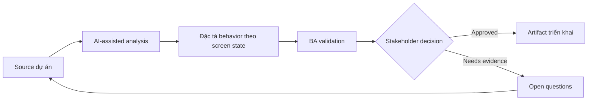

# Đặc tả behavior theo screen state

<div class="case-meta">
  <span>Frontend, UI, and UX</span>
  <span>Screen behavior</span>
  <span>Use case dự án</span>
</div>

## Project context

Team xây order management screen có state draft, submitted, approved, rejected, cancelled và archived. Design thể hiện happy path nhưng chưa nói action và field nào xuất hiện theo từng state. Trong môi trường delivery thật, tình huống này thường xuất hiện dưới áp lực thời gian: stakeholder cần clarity, delivery cần backlog, QA cần behavior test được, operations cần process chịu được exception. BA dùng AI để tăng tốc analysis và synthesis, nhưng BA vẫn chịu trách nhiệm về evidence, business meaning, stakeholder decisioning và artifact quality.

## BA challenge

BA phải đặc tả screen behavior theo lifecycle state để frontend, backend và QA hiểu giống nhau. BA cần define available action, disabled action, visible field, editable field, message và transition rule. Khó khăn thực tế là AI có thể làm material ban đầu trông hoàn chỉnh hơn mức thật sự. BA giỏi giữ output ở trạng thái reviewable bằng cách tách source-backed fact, assumption, unsupported claim, decision gap và recommended next action. Mục tiêu không phải làm document dài hơn; mục tiêu là làm project decision rõ hơn và an toàn hơn.

## Where AI fits

<div class="ba-workbench-panel">
AI hữu ích trong use case này khi được giới hạn vào analysis support, pattern detection, structured drafting và critique. AI không được approve scope, invent policy, quyết định business trade-off hoặc thay thế judgment của stakeholder chịu trách nhiệm.
</div>

- Generate state-action matrix từ lifecycle notes.
- Find missing action permission và transition rule.
- Draft UI state acceptance criteria và negative case.
- Critique disabled action có cần explanation hoặc tooltip copy không.

## Inputs to prepare

- Entity lifecycle model
- Screen design
- Permission rules
- Workflow policy
- Existing user stories

BA nên label các input này trước khi dùng AI: source owner, source date, approval status, sensitivity level, và source đó là fact, opinion, policy, draft hay historical evidence. Việc chuẩn bị này ngăn model xem mọi input đều current và authoritative như nhau.

## BA workflow

1. List từng entity state và user role.
2. Yêu cầu AI tạo state-action-field matrix.
3. Review matrix với product về business rule và frontend về feasibility.
4. Map từng transition với backend validation và audit need.
5. Viết acceptance criteria cho allowed, blocked, hidden và disabled action.
6. Thêm QA scenario cho từng role-state combination.

Workflow hiệu quả nhất khi dùng AI theo từng stage: trước hết organize evidence, sau đó yêu cầu analysis, tiếp theo tạo artifact, rồi chạy critique pass. BA nên giữ decision log visible xuyên suốt để suggestion do AI sinh ra không âm thầm trở thành approved scope.

## Diagram



## Deliverables

| Deliverable | Nội dung | Owner | Done signal |
| --- | --- | --- | --- |
| State-action matrix | State, role, visible action, disabled action, field behavior và rule | BA | Mọi action có state rule |
| Transition rule table | From state, to state, trigger, validation, audit và owner | BA và backend | Backend enforce được transition |
| UI message catalog | Tooltip, disabled reason, error và confirmation copy | UX writer | User hiểu unavailable action |
| QA coverage map | Role-state scenario và expected UI behavior | QA | State combination test được |

Các deliverable này nên được xem là artifact do BA own. AI có thể draft, nhưng BA phải validate source support, stakeholder meaning, traceability và artifact đã sẵn sàng handoff hay chưa.

## Prompt to try

```text
Hãy đóng vai senior Business Analyst hiểu AI. Hỗ trợ tôi áp dụng use case "Đặc tả behavior theo screen state" vào dự án. Trước hết hỏi source evidence và constraint. Sau đó tạo structured analysis gồm project context, assumption, AI-fit boundary, workflow step, deliverable, risk, control, open question và stakeholder decision. Không tự bịa policy, threshold hoặc approval.
```

## Review checklist

- Mọi statement do AI hỗ trợ đều gắn với source, assumption hoặc validation question.
- BA đã tách drafting assistance khỏi business approval.
- Workflow step có human owner cho decision, review và exception.
- Deliverable trace được về project input và review được bởi QA, product hoặc operations.
- Risk control đủ thực tế để dùng trong meeting dự án thật.
- Success metric: Frontend, backend và QA dùng chung một state behavior matrix cho implementation và testing.

## Risks and controls

| Rủi ro | Vì sao quan trọng | Control của BA |
| --- | --- | --- |
| State mismatch | Frontend show action nhưng backend reject | Align UI state matrix với backend transition rule |
| Hidden business rule | User thấy disabled button khó hiểu | Thêm reason copy cho blocked action |
| Role confusion | Role khác nhau cần behavior khác nhau | Include role-state matrix |
| Incomplete QA | Rare state có thể chưa test | Tạo scenario cho mọi state transition |

Control quan trọng nhất là làm uncertainty visible. Nếu evidence yếu, output nên tạo validation question hoặc decision item, không phải final requirement. Nếu artifact ảnh hưởng delivery, release, compliance, customer experience hoặc operational workload, BA nên yêu cầu human review explicit trước khi handoff.
