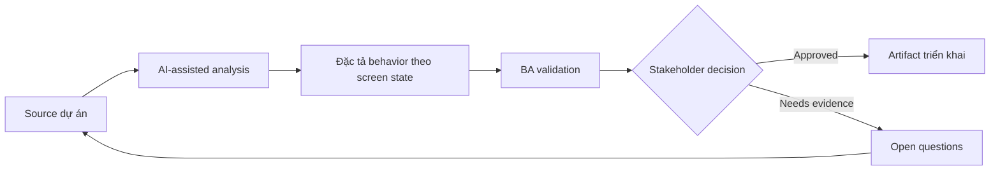

# Đặc tả behavior theo screen state

<div class="case-meta">
  <span>Frontend, UI, and UX</span>
  <span>Screen behavior</span>
  <span>Frontend/UI refinement</span>
  <span>Practitioner</span>
  <span>State-action matrix</span>
  <span>Use case dự án</span>
</div>

## Project context

Team xây order management screen có state draft, submitted, approved, rejected, cancelled và archived. Design thể hiện happy path nhưng chưa nói action và field nào xuất hiện theo từng state. Trong Screen behavior, công việc này thường bắt đầu khi screen behavior, accessibility, design state, analytics và user feedback phải thành requirement implement được. BA nên xem Entity lifecycle model và Screen design là evidence cần organize, không phải raw material để AI trả lời không kiểm soát. Mục tiêu là làm decision tiếp theo rõ hơn cho người own outcome.

## BA challenge

BA phải đặc tả screen behavior theo lifecycle state để frontend, backend và QA hiểu giống nhau. BA cần define available action, disabled action, visible field, editable field, message và transition rule. Với Đặc tả behavior theo screen state, khó khăn thực tế là missing state và UX không đo được. AI có thể tăng tốc UI-state analysis, content critique, accessibility review, event taxonomy và edge-case discovery, nhưng BA vẫn phải làm rõ assumption, approval còn thiếu và điểm cần stakeholder judgment.

## Where AI fits

<div class="ba-workbench-panel">
AI phù hợp với use case Frontend, UI và UX khi được giới hạn vào UI-state analysis, content critique, accessibility review, event taxonomy và edge-case discovery. AI task hữu ích đầu tiên là: Generate state-action matrix từ lifecycle notes. AI không được approve scope, invent policy, bỏ qua wireframe, design token, user journey, analytics question và accessibility expectation, hoặc biến draft thành final decision.
</div>

- Generate state-action matrix từ lifecycle notes.
- Find missing action permission và transition rule.
- Draft UI state acceptance criteria và negative case.
- Critique disabled action có cần explanation hoặc tooltip copy không.

## Inputs to prepare

- Entity lifecycle model
- Screen design
- Permission rules
- Workflow policy
- Existing user stories

Trước khi prompt cho Đặc tả behavior theo screen state, hãy label từng input theo owner, date, approval status, sensitivity và vai trò trong decision. Evidence lens quan trọng nhất là wireframe, design token, user journey, analytics question và accessibility expectation; nếu thiếu, AI có thể xem old note, draft design và approved rule có authority như nhau.

## BA workflow

1. List từng entity state và user role.
2. Yêu cầu AI tạo state-action-field matrix.
3. Review matrix với product về business rule và frontend về feasibility.
4. Map từng transition với backend validation và audit need.
5. Viết acceptance criteria cho allowed, blocked, hidden và disabled action.
6. Thêm QA scenario cho từng role-state combination.

Chạy workflow như screen-state review trước frontend build: bắt đầu với "List từng entity state và user role.", sau đó giữ decision log visible khi artifact tiến tới State-action matrix. Cách này ngăn suggestion của AI âm thầm trở thành backlog, design, release hoặc operational commitment.

## Diagram



## Deliverables

| Deliverable | Nội dung | Owner | Done signal |
| --- | --- | --- | --- |
| State-action matrix | State, role, visible action, disabled action, field behavior và rule | BA | Mọi action có state rule |
| Transition rule table | From state, to state, trigger, validation, audit và owner | BA và backend | Backend enforce được transition |
| UI message catalog | Tooltip, disabled reason, error và confirmation copy | UX writer | User hiểu unavailable action |
| QA coverage map | Role-state scenario và expected UI behavior | QA | State combination test được |

Hãy xem State-action matrix là frontend requirement specification do BA own. AI có thể draft structure, nhưng BA phải validate "Mọi action có state rule" có thật sự đúng không, artifact có trace được về evidence không và receiving team có hành động được không.

## Prompt to try

```text
Hãy đóng vai senior Business Analyst hiểu AI. Hỗ trợ tôi áp dụng use case "Đặc tả behavior theo screen state" vào dự án. Trước hết hỏi source evidence và constraint. Sau đó tạo structured analysis gồm project context, assumption, AI-fit boundary, workflow step, deliverable, risk, control, open question và stakeholder decision. Không tự bịa policy, threshold hoặc approval.
```

## Review checklist

- Entity lifecycle model được label owner, date, approval status và sensitivity.
- State-action matrix trace được về source evidence và có human owner rõ.
- AI task nằm trong boundary UI-state analysis, content critique, accessibility review, event taxonomy và edge-case discovery và không approve scope hoặc policy.
- Risk "State mismatch" có control thực tế: Align UI state matrix với backend transition rule.
- Open assumption được chuyển thành validation question hoặc stakeholder decision.
- Success metric: Frontend, backend và QA dùng chung một state behavior matrix cho implementation và testing.

## Risks and controls

| Rủi ro | Vì sao quan trọng | Control của BA |
| --- | --- | --- |
| State mismatch | Frontend show action nhưng backend reject | Align UI state matrix với backend transition rule |
| Hidden business rule | User thấy disabled button khó hiểu | Thêm reason copy cho blocked action |
| Role confusion | Role khác nhau cần behavior khác nhau | Include role-state matrix |
| Incomplete QA | Rare state có thể chưa test | Tạo scenario cho mọi state transition |

Control chính cho risk "State mismatch" là human accountability explicit: Align UI state matrix với backend transition rule. Nếu evidence yếu, output nên tạo validation question hoặc decision item, không phải final requirement.
