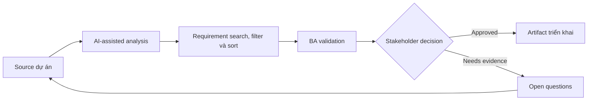

# Requirement search, filter và sort

<div class="case-meta">
  <span>Data and Integration</span>
  <span>Search experience</span>
  <span>Use case dự án</span>
</div>

## Project context

User cần tìm case trong hàng nghìn record bằng keyword search, filter, saved view và sorting. Requirement hiện chỉ nói searchable và filterable mà chưa define behavior. Trong Search experience, công việc này thường bắt đầu khi data movement, mapping, reconciliation, privacy và lineage decision ảnh hưởng nhiều system và owner. BA nên xem Record field list và User tasks là evidence cần organize, không phải raw material để AI trả lời không kiểm soát. Mục tiêu là làm decision tiếp theo rõ hơn cho người own outcome.

## BA challenge

BA phải specify search semantics, filter combination, sorting rule, saved view, empty state, performance expectation và data field included trong search. Với Requirement search, filter và sort, khó khăn thực tế là silent data loss và lineage yếu. AI có thể tăng tốc field mapping, rule comparison, reconciliation design, lineage review và exception analysis, nhưng BA vẫn phải làm rõ assumption, approval còn thiếu và điểm cần stakeholder judgment.

## Where AI fits

<div class="ba-workbench-panel">
AI phù hợp với use case Data và Integration khi được giới hạn vào field mapping, rule comparison, reconciliation design, lineage review và exception analysis. AI task hữu ích đầu tiên là: Generate search behavior question từ user task. AI không được approve scope, invent policy, bỏ qua source schema, sample payload, mapping rule, data-quality report và ownership matrix, hoặc biến draft thành final decision.
</div>

- Generate search behavior question từ user task.
- Draft filter và sort rule matrix.
- Identify ambiguity trong contains, exact match, date range và status filter.
- Tạo search acceptance criteria và edge case.

## Inputs to prepare

- Record field list
- User tasks
- Current search examples
- Data volume
- Performance requirements

Trước khi prompt cho Requirement search, filter và sort, hãy label từng input theo owner, date, approval status, sensitivity và vai trò trong decision. Evidence lens quan trọng nhất là source schema, sample payload, mapping rule, data-quality report và ownership matrix; nếu thiếu, AI có thể xem old note, draft design và approved rule có authority như nhau.

## BA workflow

1. List user search task và field user expect search được.
2. Yêu cầu AI identify ambiguity search/filter/sort.
3. Define searchable field, match logic, filter combination, sort order và saved view behavior.
4. Review backend search feasibility và performance constraint.
5. Viết acceptance criteria cho no results, partial matches, invalid filters và permissions.
6. Tạo QA data set có edge case.

Chạy workflow như data contract review trước integration build: bắt đầu với "List user search task và field user expect search được.", sau đó giữ decision log visible khi artifact tiến tới Search behavior spec. Cách này ngăn suggestion của AI âm thầm trở thành backlog, design, release hoặc operational commitment.

## Diagram



## Deliverables

| Deliverable | Nội dung | Owner | Done signal |
| --- | --- | --- | --- |
| Search behavior spec | Field, match type, ranking, permission và result display | BA | Search semantics rõ |
| Filter/sort matrix | Filter, operator, combination rule, default và edge case | BA và backend | Filter logic implementable |
| Saved view requirement | Create, edit, share, default, permission và deletion behavior | Product owner | Saved view có lifecycle |
| Search QA data set | Record, expected match, no-match case và permission case | QA | Search verify được |

Hãy xem Search behavior spec là data and integration control pack do BA own. AI có thể draft structure, nhưng BA phải validate "Search semantics rõ" có thật sự đúng không, artifact có trace được về evidence không và receiving team có hành động được không.

## Prompt to try

```text
Hãy đóng vai senior Business Analyst hiểu AI. Hỗ trợ tôi áp dụng use case "Requirement search, filter và sort" vào dự án. Trước hết hỏi source evidence và constraint. Sau đó tạo structured analysis gồm project context, assumption, AI-fit boundary, workflow step, deliverable, risk, control, open question và stakeholder decision. Không tự bịa policy, threshold hoặc approval.
```

## Review checklist

- Record field list được label owner, date, approval status và sensitivity.
- Search behavior spec trace được về source evidence và có human owner rõ.
- AI task nằm trong boundary field mapping, rule comparison, reconciliation design, lineage review và exception analysis và không approve scope hoặc policy.
- Risk "Search ambiguity" có control thực tế: Define match behavior và searchable field.
- Open assumption được chuyển thành validation question hoặc stakeholder decision.
- Success metric: Search và filtering behavior đủ precise để implement, test và explain cho user.

## Risks and controls

| Rủi ro | Vì sao quan trọng | Control của BA |
| --- | --- | --- |
| Search ambiguity | User và developer expect match logic khác nhau | Define match behavior và searchable field |
| Filter conflict | Combined filter behave unexpected | Specify AND/OR và default rule |
| Permission leakage | Search expose record user không được thấy | Include permission filtering |
| Performance gap | Search đúng nhưng quá chậm | Thêm performance expectation |

Control chính cho risk "Search ambiguity" là human accountability explicit: Define match behavior và searchable field. Nếu evidence yếu, output nên tạo validation question hoặc decision item, không phải final requirement.
