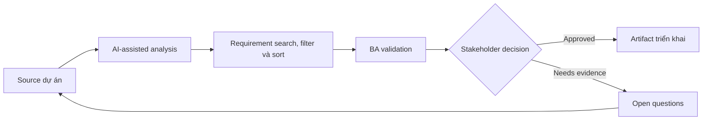

# Requirement search, filter và sort

<div class="case-meta">
  <span>Data and Integration</span>
  <span>Search experience</span>
  <span>Use case dự án</span>
</div>

## Project context

User cần tìm case trong hàng nghìn record bằng keyword search, filter, saved view và sorting. Requirement hiện chỉ nói searchable và filterable mà chưa define behavior. Trong môi trường delivery thật, tình huống này thường xuất hiện dưới áp lực thời gian: stakeholder cần clarity, delivery cần backlog, QA cần behavior test được, operations cần process chịu được exception. BA dùng AI để tăng tốc analysis và synthesis, nhưng BA vẫn chịu trách nhiệm về evidence, business meaning, stakeholder decisioning và artifact quality.

## BA challenge

BA phải specify search semantics, filter combination, sorting rule, saved view, empty state, performance expectation và data field included trong search. Khó khăn thực tế là AI có thể làm material ban đầu trông hoàn chỉnh hơn mức thật sự. BA giỏi giữ output ở trạng thái reviewable bằng cách tách source-backed fact, assumption, unsupported claim, decision gap và recommended next action. Mục tiêu không phải làm document dài hơn; mục tiêu là làm project decision rõ hơn và an toàn hơn.

## Where AI fits

<div class="ba-workbench-panel">
AI hữu ích trong use case này khi được giới hạn vào analysis support, pattern detection, structured drafting và critique. AI không được approve scope, invent policy, quyết định business trade-off hoặc thay thế judgment của stakeholder chịu trách nhiệm.
</div>

- Generate search behavior question từ user task.
- Draft filter và sort rule matrix.
- Identify ambiguity trong contains, exact match, date range và status filter.
- Tạo search acceptance criteria và edge case.

## Inputs to prepare

- Record field list
- User tasks
- Current search examples
- Data volume
- Performance requirements

BA nên label các input này trước khi dùng AI: source owner, source date, approval status, sensitivity level, và source đó là fact, opinion, policy, draft hay historical evidence. Việc chuẩn bị này ngăn model xem mọi input đều current và authoritative như nhau.

## BA workflow

1. List user search task và field user expect search được.
2. Yêu cầu AI identify ambiguity search/filter/sort.
3. Define searchable field, match logic, filter combination, sort order và saved view behavior.
4. Review backend search feasibility và performance constraint.
5. Viết acceptance criteria cho no results, partial matches, invalid filters và permissions.
6. Tạo QA data set có edge case.

Workflow hiệu quả nhất khi dùng AI theo từng stage: trước hết organize evidence, sau đó yêu cầu analysis, tiếp theo tạo artifact, rồi chạy critique pass. BA nên giữ decision log visible xuyên suốt để suggestion do AI sinh ra không âm thầm trở thành approved scope.

## Diagram



## Deliverables

| Deliverable | Nội dung | Owner | Done signal |
| --- | --- | --- | --- |
| Search behavior spec | Field, match type, ranking, permission và result display | BA | Search semantics rõ |
| Filter/sort matrix | Filter, operator, combination rule, default và edge case | BA và backend | Filter logic implementable |
| Saved view requirement | Create, edit, share, default, permission và deletion behavior | Product owner | Saved view có lifecycle |
| Search QA data set | Record, expected match, no-match case và permission case | QA | Search verify được |

Các deliverable này nên được xem là artifact do BA own. AI có thể draft, nhưng BA phải validate source support, stakeholder meaning, traceability và artifact đã sẵn sàng handoff hay chưa.

## Prompt to try

```text
Hãy đóng vai senior Business Analyst hiểu AI. Hỗ trợ tôi áp dụng use case "Requirement search, filter và sort" vào dự án. Trước hết hỏi source evidence và constraint. Sau đó tạo structured analysis gồm project context, assumption, AI-fit boundary, workflow step, deliverable, risk, control, open question và stakeholder decision. Không tự bịa policy, threshold hoặc approval.
```

## Review checklist

- Mọi statement do AI hỗ trợ đều gắn với source, assumption hoặc validation question.
- BA đã tách drafting assistance khỏi business approval.
- Workflow step có human owner cho decision, review và exception.
- Deliverable trace được về project input và review được bởi QA, product hoặc operations.
- Risk control đủ thực tế để dùng trong meeting dự án thật.
- Success metric: Search và filtering behavior đủ precise để implement, test và explain cho user.

## Risks and controls

| Rủi ro | Vì sao quan trọng | Control của BA |
| --- | --- | --- |
| Search ambiguity | User và developer expect match logic khác nhau | Define match behavior và searchable field |
| Filter conflict | Combined filter behave unexpected | Specify AND/OR và default rule |
| Permission leakage | Search expose record user không được thấy | Include permission filtering |
| Performance gap | Search đúng nhưng quá chậm | Thêm performance expectation |

Control quan trọng nhất là làm uncertainty visible. Nếu evidence yếu, output nên tạo validation question hoặc decision item, không phải final requirement. Nếu artifact ảnh hưởng delivery, release, compliance, customer experience hoặc operational workload, BA nên yêu cầu human review explicit trước khi handoff.
