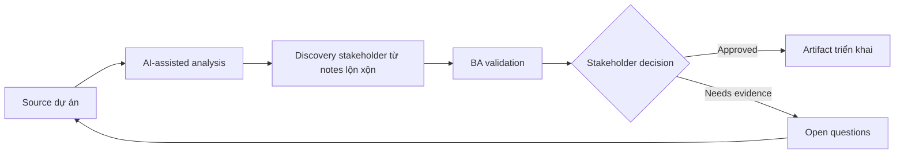

# Discovery stakeholder từ notes lộn xộn

<div class="case-meta">
  <span>Discovery and alignment</span>
  <span>Cross-functional product discovery</span>
  <span>Use case dự án</span>
</div>

## Project context

Product team bắt đầu dự án cải thiện customer onboarding sau nhiều buổi họp rời rạc với sales, support, compliance và operations. Notes thiếu, stakeholder nói mâu thuẫn, và BA phải chuẩn bị discovery summary trước workshop tiếp theo. Trong Cross-functional product discovery, công việc này thường bắt đầu khi stakeholder mô tả cùng một vấn đề từ incentive và mức chi tiết khác nhau. BA nên xem Meeting notes và transcript và Danh sách stakeholder role là evidence cần organize, không phải raw material để AI trả lời không kiểm soát. Mục tiêu là làm decision tiếp theo rõ hơn cho người own outcome.

## BA challenge

BA phải giữ nuance nhưng vẫn biến raw notes thành theme, confirmed fact, conflict, decision needed và requirement candidate. Phần khó là tránh false consensus: sales muốn activation tức thì, compliance yêu cầu KYC hoàn tất, support cần hướng dẫn upload document rõ hơn. Với Discovery stakeholder từ notes lộn xộn, khó khăn thực tế là false consensus và invented scope. AI có thể tăng tốc sensemaking, contradiction detection, question generation và workshop preparation, nhưng BA vẫn phải làm rõ assumption, approval còn thiếu và điểm cần stakeholder judgment.

## Where AI fits

<div class="ba-workbench-panel">
AI phù hợp với use case Discovery và alignment khi được giới hạn vào sensemaking, contradiction detection, question generation và workshop preparation. AI task hữu ích đầu tiên là: Cluster notes thành theme nhưng không xóa speaker attribution. AI không được approve scope, invent policy, bỏ qua speaker attribution, decision authority và source freshness, hoặc biến draft thành final decision.
</div>

- Cluster notes thành theme nhưng không xóa speaker attribution.
- Extract fact, assumption, contradiction và implied requirement.
- Sinh câu hỏi validation riêng theo từng stakeholder.
- Chuẩn bị workshop agenda tập trung vào decision.

## Inputs to prepare

- Meeting notes và transcript
- Danh sách stakeholder role
- Current process notes
- Business goal đã biết
- Open question từ workshop trước

Trước khi prompt cho Discovery stakeholder từ notes lộn xộn, hãy label từng input theo owner, date, approval status, sensitivity và vai trò trong decision. Evidence lens quan trọng nhất là speaker attribution, decision authority và source freshness; nếu thiếu, AI có thể xem old note, draft design và approved rule có authority như nhau.

## BA workflow

1. Tạo source map với tên stakeholder và ngày họp.
2. Yêu cầu AI classify từng note thành fact, opinion, assumption, pain point, requirement candidate hoặc conflict.
3. Review output AI và khôi phục speaker attribution nếu bị mất.
4. Chuyển conflict thành decision question có decision owner.
5. Draft workshop agenda bắt đầu bằng decision, không chỉ topic.
6. Publish synthesis pack có evidence label và unresolved assumption.

Chạy workflow như gom evidence trước khi bàn solution: bắt đầu với "Tạo source map với tên stakeholder và ngày họp.", sau đó giữ decision log visible khi artifact tiến tới Discovery synthesis pack. Cách này ngăn suggestion của AI âm thầm trở thành backlog, design, release hoặc operational commitment.

## Diagram



## Deliverables

| Deliverable | Nội dung | Owner | Done signal |
| --- | --- | --- | --- |
| Discovery synthesis pack | Theme, fact, contradiction, assumption và quote có source ID | BA | Mỗi finding có stakeholder attribution |
| Decision backlog | Câu hỏi cần business decision trước khi final requirement | Product owner | Mỗi decision có owner và target date |
| Workshop agenda | Validation question được ưu tiên theo risk | BA | Agenda tập trung vào conflict và decision gap |
| Requirement candidates | Requirement statement ban đầu có evidence và assumption | BA | Không candidate nào là final nếu chưa validation |

Hãy xem Discovery synthesis pack là alignment artifact do BA own. AI có thể draft structure, nhưng BA phải validate "Mỗi finding có stakeholder attribution" có thật sự đúng không, artifact có trace được về evidence không và receiving team có hành động được không.

## Prompt to try

```text
Hãy đóng vai senior Business Analyst hiểu AI. Hỗ trợ tôi áp dụng use case "Discovery stakeholder từ notes lộn xộn" vào dự án. Trước hết hỏi source evidence và constraint. Sau đó tạo structured analysis gồm project context, assumption, AI-fit boundary, workflow step, deliverable, risk, control, open question và stakeholder decision. Không tự bịa policy, threshold hoặc approval.
```

## Review checklist

- Meeting notes và transcript được label owner, date, approval status và sensitivity.
- Discovery synthesis pack trace được về source evidence và có human owner rõ.
- AI task nằm trong boundary sensemaking, contradiction detection, question generation và workshop preparation và không approve scope hoặc policy.
- Risk "False consensus" có control thực tế: Bắt buộc có speaker attribution và contradiction table.
- Open assumption được chuyển thành validation question hoặc stakeholder decision.
- Success metric: Workshop tiếp theo resolve được conflict rủi ro cao nhất và có owner cho mọi open decision.

## Risks and controls

| Rủi ro | Vì sao quan trọng | Control của BA |
| --- | --- | --- |
| False consensus | AI có thể merge statement conflict thành narrative sạch | Bắt buộc có speaker attribution và contradiction table |
| Unsupported requirement | AI có thể infer scope chưa ai approve | Mark mọi inference là assumption cần validate |
| Stakeholder politics | Concern ít người nói có thể biến mất trong summary | Track source role và decision authority |
| Workshop drift | Thảo luận có thể đi vào topic dễ | Rank question theo risk và dependency |

Control chính cho risk "False consensus" là human accountability explicit: Bắt buộc có speaker attribution và contradiction table. Nếu evidence yếu, output nên tạo validation question hoặc decision item, không phải final requirement.
