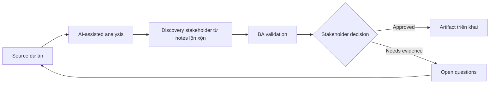

# Discovery stakeholder từ notes lộn xộn

<div class="case-meta">
  <span>Discovery and alignment</span>
  <span>Cross-functional product discovery</span>
  <span>Use case dự án</span>
</div>

## Project context

Product team bắt đầu dự án cải thiện customer onboarding sau nhiều buổi họp rời rạc với sales, support, compliance và operations. Notes thiếu, stakeholder nói mâu thuẫn, và BA phải chuẩn bị discovery summary trước workshop tiếp theo. Trong môi trường delivery thật, tình huống này thường xuất hiện dưới áp lực thời gian: stakeholder cần clarity, delivery cần backlog, QA cần behavior test được, operations cần process chịu được exception. BA dùng AI để tăng tốc analysis và synthesis, nhưng BA vẫn chịu trách nhiệm về evidence, business meaning, stakeholder decisioning và artifact quality.

## BA challenge

BA phải giữ nuance nhưng vẫn biến raw notes thành theme, confirmed fact, conflict, decision needed và requirement candidate. Phần khó là tránh false consensus: sales muốn activation tức thì, compliance yêu cầu KYC hoàn tất, support cần hướng dẫn upload document rõ hơn. Khó khăn thực tế là AI có thể làm material ban đầu trông hoàn chỉnh hơn mức thật sự. BA giỏi giữ output ở trạng thái reviewable bằng cách tách source-backed fact, assumption, unsupported claim, decision gap và recommended next action. Mục tiêu không phải làm document dài hơn; mục tiêu là làm project decision rõ hơn và an toàn hơn.

## Where AI fits

<div class="ba-workbench-panel">
AI hữu ích trong use case này khi được giới hạn vào analysis support, pattern detection, structured drafting và critique. AI không được approve scope, invent policy, quyết định business trade-off hoặc thay thế judgment của stakeholder chịu trách nhiệm.
</div>

- Cluster notes thành theme nhưng không xóa speaker attribution.
- Extract fact, assumption, contradiction và implied requirement.
- Sinh câu hỏi validation riêng theo từng stakeholder.
- Chuẩn bị workshop agenda tập trung vào decision.

## Inputs to prepare

- Meeting notes và transcript
- Danh sách stakeholder role
- Current process notes
- Business goal đã biết
- Open question từ workshop trước

BA nên label các input này trước khi dùng AI: source owner, source date, approval status, sensitivity level, và source đó là fact, opinion, policy, draft hay historical evidence. Việc chuẩn bị này ngăn model xem mọi input đều current và authoritative như nhau.

## BA workflow

1. Tạo source map với tên stakeholder và ngày họp.
2. Yêu cầu AI classify từng note thành fact, opinion, assumption, pain point, requirement candidate hoặc conflict.
3. Review output AI và khôi phục speaker attribution nếu bị mất.
4. Chuyển conflict thành decision question có decision owner.
5. Draft workshop agenda bắt đầu bằng decision, không chỉ topic.
6. Publish synthesis pack có evidence label và unresolved assumption.

Workflow hiệu quả nhất khi dùng AI theo từng stage: trước hết organize evidence, sau đó yêu cầu analysis, tiếp theo tạo artifact, rồi chạy critique pass. BA nên giữ decision log visible xuyên suốt để suggestion do AI sinh ra không âm thầm trở thành approved scope.

## Diagram



## Deliverables

| Deliverable | Nội dung | Owner | Done signal |
| --- | --- | --- | --- |
| Discovery synthesis pack | Theme, fact, contradiction, assumption và quote có source ID | BA | Mỗi finding có stakeholder attribution |
| Decision backlog | Câu hỏi cần business decision trước khi final requirement | Product owner | Mỗi decision có owner và target date |
| Workshop agenda | Validation question được ưu tiên theo risk | BA | Agenda tập trung vào conflict và decision gap |
| Requirement candidates | Requirement statement ban đầu có evidence và assumption | BA | Không candidate nào là final nếu chưa validation |

Các deliverable này nên được xem là artifact do BA own. AI có thể draft, nhưng BA phải validate source support, stakeholder meaning, traceability và artifact đã sẵn sàng handoff hay chưa.

## Prompt to try

```text
Hãy đóng vai senior Business Analyst hiểu AI. Hỗ trợ tôi áp dụng use case "Discovery stakeholder từ notes lộn xộn" vào dự án. Trước hết hỏi source evidence và constraint. Sau đó tạo structured analysis gồm project context, assumption, AI-fit boundary, workflow step, deliverable, risk, control, open question và stakeholder decision. Không tự bịa policy, threshold hoặc approval.
```

## Review checklist

- Mọi statement do AI hỗ trợ đều gắn với source, assumption hoặc validation question.
- BA đã tách drafting assistance khỏi business approval.
- Workflow step có human owner cho decision, review và exception.
- Deliverable trace được về project input và review được bởi QA, product hoặc operations.
- Risk control đủ thực tế để dùng trong meeting dự án thật.
- Success metric: Workshop tiếp theo resolve được conflict rủi ro cao nhất và có owner cho mọi open decision.

## Risks and controls

| Rủi ro | Vì sao quan trọng | Control của BA |
| --- | --- | --- |
| False consensus | AI có thể merge statement conflict thành narrative sạch | Bắt buộc có speaker attribution và contradiction table |
| Unsupported requirement | AI có thể infer scope chưa ai approve | Mark mọi inference là assumption cần validate |
| Stakeholder politics | Concern ít người nói có thể biến mất trong summary | Track source role và decision authority |
| Workshop drift | Thảo luận có thể đi vào topic dễ | Rank question theo risk và dependency |

Control quan trọng nhất là làm uncertainty visible. Nếu evidence yếu, output nên tạo validation question hoặc decision item, không phải final requirement. Nếu artifact ảnh hưởng delivery, release, compliance, customer experience hoặc operational workload, BA nên yêu cầu human review explicit trước khi handoff.
