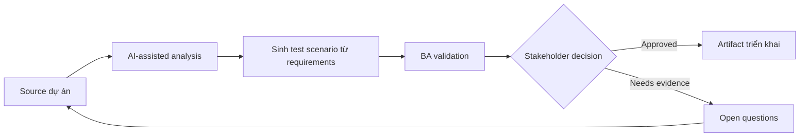

# Sinh test scenario từ requirements

<div class="case-meta">
  <span>Delivery and QA</span>
  <span>QA collaboration</span>
  <span>Use case dự án</span>
</div>

## Project context

QA team nhận bộ user story cho admin module nặng về permission. Thời gian ngắn, tester cần scenario coverage cho role, data state, negative path, audit và regression risk. Trong QA collaboration, công việc này thường bắt đầu khi delivery decision, test evidence và release readiness phải còn nối với intent ban đầu. BA nên xem User stories và Acceptance criteria là evidence cần organize, không phải raw material để AI trả lời không kiểm soát. Mục tiêu là làm decision tiếp theo rõ hơn cho người own outcome.

## BA challenge

BA phải hỗ trợ QA generate scenario mà không để AI invent rule. Output tốt nhất link từng scenario tới requirement evidence, acceptance criteria và risk priority để QA focus coverage quan trọng. Với Sinh test scenario từ requirements, khó khăn thực tế là optimistic status và late requirement discovery. AI có thể tăng tốc scenario generation, defect triage support, readiness synthesis và risk surfacing, nhưng BA vẫn phải làm rõ assumption, approval còn thiếu và điểm cần stakeholder judgment.

## Where AI fits

<div class="ba-workbench-panel">
AI phù hợp với use case Delivery và QA khi được giới hạn vào scenario generation, defect triage support, readiness synthesis và risk surfacing. AI task hữu ích đầu tiên là: Generate scenario category từ acceptance criteria. AI không được approve scope, invent policy, bỏ qua requirement baseline, test result, defect history và release decision, hoặc biến draft thành final decision.
</div>

- Generate scenario category từ acceptance criteria.
- Tạo positive, negative, boundary, permission, audit và regression case.
- Identify missing criteria trước khi QA execute.
- Prioritize scenario theo risk và business impact.

## Inputs to prepare

- User stories
- Acceptance criteria
- Role matrix
- Data state definitions
- Prior defect history

Trước khi prompt cho Sinh test scenario từ requirements, hãy label từng input theo owner, date, approval status, sensitivity và vai trò trong decision. Evidence lens quan trọng nhất là requirement baseline, test result, defect history và release decision; nếu thiếu, AI có thể xem old note, draft design và approved rule có authority như nhau.

## BA workflow

1. Yêu cầu AI extract rule từ requirement và list missing rule riêng.
2. Generate test scenario có source requirement ID.
3. Label từng scenario theo type và risk level.
4. Review unsupported scenario với BA và QA trước khi thêm.
5. Map scenario với test data need và expected result.
6. Update acceptance criteria nếu scenario generation làm lộ gap.

Chạy workflow như quality review trước release hoặc rework decision: bắt đầu với "Yêu cầu AI extract rule từ requirement và list missing rule riêng.", sau đó giữ decision log visible khi artifact tiến tới Scenario coverage matrix. Cách này ngăn suggestion của AI âm thầm trở thành backlog, design, release hoặc operational commitment.

## Diagram



## Deliverables

| Deliverable | Nội dung | Owner | Done signal |
| --- | --- | --- | --- |
| Scenario coverage matrix | Requirement, scenario, type, risk, test data và expected result | QA và BA | Mọi high-risk rule có scenario coverage |
| Missing criteria list | Rule cần có trước khi testing complete | BA | Gap trở thành clarification question |
| Test data plan | Data state và role cần cho execution | QA | Critical data available trước test run |
| Regression focus list | Area có khả năng affected bởi change | Tech lead và QA | Regression scope risk-based |

Hãy xem Scenario coverage matrix là QA và delivery handoff artifact do BA own. AI có thể draft structure, nhưng BA phải validate "Mọi high-risk rule có scenario coverage" có thật sự đúng không, artifact có trace được về evidence không và receiving team có hành động được không.

## Prompt to try

```text
Hãy đóng vai senior Business Analyst hiểu AI. Hỗ trợ tôi áp dụng use case "Sinh test scenario từ requirements" vào dự án. Trước hết hỏi source evidence và constraint. Sau đó tạo structured analysis gồm project context, assumption, AI-fit boundary, workflow step, deliverable, risk, control, open question và stakeholder decision. Không tự bịa policy, threshold hoặc approval.
```

## Review checklist

- User stories được label owner, date, approval status và sensitivity.
- Scenario coverage matrix trace được về source evidence và có human owner rõ.
- AI task nằm trong boundary scenario generation, defect triage support, readiness synthesis và risk surfacing và không approve scope hoặc policy.
- Risk "Invented tests" có control thực tế: Bắt buộc source ID và assumption label.
- Open assumption được chuyển thành validation question hoặc stakeholder decision.
- Success metric: QA nhận scenario coverage traceable, prioritized và aligned với business rule.

## Risks and controls

| Rủi ro | Vì sao quan trọng | Control của BA |
| --- | --- | --- |
| Invented tests | AI có thể tạo scenario cho rule không tồn tại | Bắt buộc source ID và assumption label |
| Coverage overload | Quá nhiều scenario làm loãng critical risk | Rank theo business impact và failure cost |
| Missing data setup | Scenario tốt fail vì test data chưa có | Thêm test data requirement sớm |
| BA-QA disconnect | QA có thể test behavior BA không intended | Review scenario matrix cùng nhau |

Control chính cho risk "Invented tests" là human accountability explicit: Bắt buộc source ID và assumption label. Nếu evidence yếu, output nên tạo validation question hoặc decision item, không phải final requirement.
