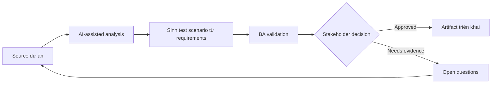

# Sinh test scenario từ requirements

<div class="case-meta">
  <span>Delivery and QA</span>
  <span>QA collaboration</span>
  <span>Use case dự án</span>
</div>

## Project context

QA team nhận bộ user story cho admin module nặng về permission. Thời gian ngắn, tester cần scenario coverage cho role, data state, negative path, audit và regression risk. Trong môi trường delivery thật, tình huống này thường xuất hiện dưới áp lực thời gian: stakeholder cần clarity, delivery cần backlog, QA cần behavior test được, operations cần process chịu được exception. BA dùng AI để tăng tốc analysis và synthesis, nhưng BA vẫn chịu trách nhiệm về evidence, business meaning, stakeholder decisioning và artifact quality.

## BA challenge

BA phải hỗ trợ QA generate scenario mà không để AI invent rule. Output tốt nhất link từng scenario tới requirement evidence, acceptance criteria và risk priority để QA focus coverage quan trọng. Khó khăn thực tế là AI có thể làm material ban đầu trông hoàn chỉnh hơn mức thật sự. BA giỏi giữ output ở trạng thái reviewable bằng cách tách source-backed fact, assumption, unsupported claim, decision gap và recommended next action. Mục tiêu không phải làm document dài hơn; mục tiêu là làm project decision rõ hơn và an toàn hơn.

## Where AI fits

<div class="ba-workbench-panel">
AI hữu ích trong use case này khi được giới hạn vào analysis support, pattern detection, structured drafting và critique. AI không được approve scope, invent policy, quyết định business trade-off hoặc thay thế judgment của stakeholder chịu trách nhiệm.
</div>

- Generate scenario category từ acceptance criteria.
- Tạo positive, negative, boundary, permission, audit và regression case.
- Identify missing criteria trước khi QA execute.
- Prioritize scenario theo risk và business impact.

## Inputs to prepare

- User stories
- Acceptance criteria
- Role matrix
- Data state definitions
- Prior defect history

BA nên label các input này trước khi dùng AI: source owner, source date, approval status, sensitivity level, và source đó là fact, opinion, policy, draft hay historical evidence. Việc chuẩn bị này ngăn model xem mọi input đều current và authoritative như nhau.

## BA workflow

1. Yêu cầu AI extract rule từ requirement và list missing rule riêng.
2. Generate test scenario có source requirement ID.
3. Label từng scenario theo type và risk level.
4. Review unsupported scenario với BA và QA trước khi thêm.
5. Map scenario với test data need và expected result.
6. Update acceptance criteria nếu scenario generation làm lộ gap.

Workflow hiệu quả nhất khi dùng AI theo từng stage: trước hết organize evidence, sau đó yêu cầu analysis, tiếp theo tạo artifact, rồi chạy critique pass. BA nên giữ decision log visible xuyên suốt để suggestion do AI sinh ra không âm thầm trở thành approved scope.

## Diagram



## Deliverables

| Deliverable | Nội dung | Owner | Done signal |
| --- | --- | --- | --- |
| Scenario coverage matrix | Requirement, scenario, type, risk, test data và expected result | QA và BA | Mọi high-risk rule có scenario coverage |
| Missing criteria list | Rule cần có trước khi testing complete | BA | Gap trở thành clarification question |
| Test data plan | Data state và role cần cho execution | QA | Critical data available trước test run |
| Regression focus list | Area có khả năng affected bởi change | Tech lead và QA | Regression scope risk-based |

Các deliverable này nên được xem là artifact do BA own. AI có thể draft, nhưng BA phải validate source support, stakeholder meaning, traceability và artifact đã sẵn sàng handoff hay chưa.

## Prompt to try

```text
Hãy đóng vai senior Business Analyst hiểu AI. Hỗ trợ tôi áp dụng use case "Sinh test scenario từ requirements" vào dự án. Trước hết hỏi source evidence và constraint. Sau đó tạo structured analysis gồm project context, assumption, AI-fit boundary, workflow step, deliverable, risk, control, open question và stakeholder decision. Không tự bịa policy, threshold hoặc approval.
```

## Review checklist

- Mọi statement do AI hỗ trợ đều gắn với source, assumption hoặc validation question.
- BA đã tách drafting assistance khỏi business approval.
- Workflow step có human owner cho decision, review và exception.
- Deliverable trace được về project input và review được bởi QA, product hoặc operations.
- Risk control đủ thực tế để dùng trong meeting dự án thật.
- Success metric: QA nhận scenario coverage traceable, prioritized và aligned với business rule.

## Risks and controls

| Rủi ro | Vì sao quan trọng | Control của BA |
| --- | --- | --- |
| Invented tests | AI có thể tạo scenario cho rule không tồn tại | Bắt buộc source ID và assumption label |
| Coverage overload | Quá nhiều scenario làm loãng critical risk | Rank theo business impact và failure cost |
| Missing data setup | Scenario tốt fail vì test data chưa có | Thêm test data requirement sớm |
| BA-QA disconnect | QA có thể test behavior BA không intended | Review scenario matrix cùng nhau |

Control quan trọng nhất là làm uncertainty visible. Nếu evidence yếu, output nên tạo validation question hoặc decision item, không phải final requirement. Nếu artifact ảnh hưởng delivery, release, compliance, customer experience hoặc operational workload, BA nên yêu cầu human review explicit trước khi handoff.
