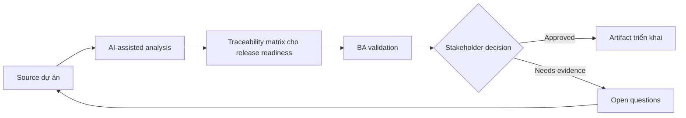

# Traceability matrix cho release readiness

<div class="case-meta">
  <span>Requirements and backlog</span>
  <span>Release governance</span>
  <span>Refinement</span>
  <span>Core</span>
  <span>Traceability matrix</span>
  <span>Use case dự án</span>
</div>

## Project context

Một release gồm thay đổi ở onboarding, notification, permission, reporting và support workflow. Stakeholder hỏi liệu mọi approved requirement đã được cover bởi development và testing trước go-live chưa. Trong Release governance, công việc này thường bắt đầu khi story phải test được mà không mất business rule, exception, data need hoặc NFR. BA nên xem BRD hoặc requirement list và Decision log là evidence cần organize, không phải raw material để AI trả lời không kiểm soát. Mục tiêu là làm decision tiếp theo rõ hơn cho người own outcome.

## BA challenge

BA phải tạo traceability matrix link business goal, requirement, decision, source evidence, story, acceptance criteria, test case, defect và release sign-off. AI có thể reconcile artifact, nhưng BA phải verify link và unresolved gap. Với Traceability matrix cho release readiness, khó khăn thực tế là criteria mơ hồ và assumption không owner. AI có thể tăng tốc gap finding, rewrite critique, edge-case expansion và acceptance-criteria drafting, nhưng BA vẫn phải làm rõ assumption, approval còn thiếu và điểm cần stakeholder judgment.

## Where AI fits

<div class="ba-workbench-panel">
AI phù hợp với use case Requirements và backlog khi được giới hạn vào gap finding, rewrite critique, edge-case expansion và acceptance-criteria drafting. AI task hữu ích đầu tiên là: Extract requirement ID và acceptance criteria từ backlog item. AI không được approve scope, invent policy, bỏ qua rule đã approve, example, edge case và expectation của QA, hoặc biến draft thành final decision.
</div>

- Extract requirement ID và acceptance criteria từ backlog item.
- Match requirement với source decision và test case.
- Identify orphan requirement, untested criteria và unresolved defect.
- Tạo release readiness summary cho stakeholder.

## Inputs to prepare

- BRD hoặc requirement list
- Decision log
- Jira hoặc backlog export
- Test case list
- Defect list

Trước khi prompt cho Traceability matrix cho release readiness, hãy label từng input theo owner, date, approval status, sensitivity và vai trò trong decision. Evidence lens quan trọng nhất là rule đã approve, example, edge case và expectation của QA; nếu thiếu, AI có thể xem old note, draft design và approved rule có authority như nhau.

## BA workflow

1. Normalize ID qua requirement, story, test và defect.
2. Yêu cầu AI propose trace link và confidence cho từng link.
3. Verify thủ công link high-risk hoặc low-confidence.
4. Identify gap: no story, no test, open defect, missing decision hoặc scope conflict.
5. Review readiness với product, QA, engineering và operations.
6. Publish release traceability và sign-off exception.

Chạy workflow như clarify requirement trước khi commit sprint: bắt đầu với "Normalize ID qua requirement, story, test và defect.", sau đó giữ decision log visible khi artifact tiến tới Traceability matrix. Cách này ngăn suggestion của AI âm thầm trở thành backlog, design, release hoặc operational commitment.

## Diagram



## Deliverables

| Deliverable | Nội dung | Owner | Done signal |
| --- | --- | --- | --- |
| Traceability matrix | Goal, requirement, source, story, acceptance criteria, test, defect và status | BA | Mọi approved requirement có coverage status |
| Gap report | Missing story, missing test, open defect và unresolved decision | BA và QA | Gap được assigned hoặc accepted |
| Release readiness summary | Coverage, exception, risk và sign-off recommendation | Product owner | Stakeholder có thể ra go-live decision |
| Change impact notes | Requirement bị ảnh hưởng bởi late change hoặc defect | BA | Impact visible trước release |

Hãy xem Traceability matrix là delivery-ready backlog artifact do BA own. AI có thể draft structure, nhưng BA phải validate "Mọi approved requirement có coverage status" có thật sự đúng không, artifact có trace được về evidence không và receiving team có hành động được không.

## Prompt to try

```text
Hãy đóng vai senior Business Analyst hiểu AI. Hỗ trợ tôi áp dụng use case "Traceability matrix cho release readiness" vào dự án. Trước hết hỏi source evidence và constraint. Sau đó tạo structured analysis gồm project context, assumption, AI-fit boundary, workflow step, deliverable, risk, control, open question và stakeholder decision. Không tự bịa policy, threshold hoặc approval.
```

## Review checklist

- BRD hoặc requirement list được label owner, date, approval status và sensitivity.
- Traceability matrix trace được về source evidence và có human owner rõ.
- AI task nằm trong boundary gap finding, rewrite critique, edge-case expansion và acceptance-criteria drafting và không approve scope hoặc policy.
- Risk "False match" có control thực tế: Verify material link thủ công.
- Open assumption được chuyển thành validation question hoặc stakeholder decision.
- Success metric: Release sign-off dựa trên coverage và accepted exception visible, không dựa vào artifact rời rạc.

## Risks and controls

| Rủi ro | Vì sao quan trọng | Control của BA |
| --- | --- | --- |
| False match | AI có thể link artifact có wording giống nhưng meaning khác | Verify material link thủ công |
| Coverage illusion | Requirement có test nhưng test không cover rule | Check test intent, không chỉ ID match |
| Late exception hiding | Open defect có thể bị minimize trong summary | Giữ exception explicit có owner và decision |
| Matrix overload | Quá nhiều detail có thể che release risk | Thêm summary theo risk và readiness status |

Control chính cho risk "False match" là human accountability explicit: Verify material link thủ công. Nếu evidence yếu, output nên tạo validation question hoặc decision item, không phải final requirement.
