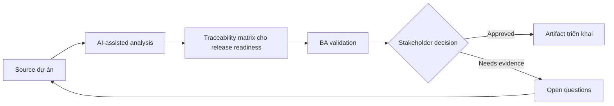

# Traceability matrix cho release readiness

<div class="case-meta">
  <span>Requirements and backlog</span>
  <span>Release governance</span>
  <span>Use case dự án</span>
</div>

## Project context

Một release gồm thay đổi ở onboarding, notification, permission, reporting và support workflow. Stakeholder hỏi liệu mọi approved requirement đã được cover bởi development và testing trước go-live chưa. Trong môi trường delivery thật, tình huống này thường xuất hiện dưới áp lực thời gian: stakeholder cần clarity, delivery cần backlog, QA cần behavior test được, operations cần process chịu được exception. BA dùng AI để tăng tốc analysis và synthesis, nhưng BA vẫn chịu trách nhiệm về evidence, business meaning, stakeholder decisioning và artifact quality.

## BA challenge

BA phải tạo traceability matrix link business goal, requirement, decision, source evidence, story, acceptance criteria, test case, defect và release sign-off. AI có thể reconcile artifact, nhưng BA phải verify link và unresolved gap. Khó khăn thực tế là AI có thể làm material ban đầu trông hoàn chỉnh hơn mức thật sự. BA giỏi giữ output ở trạng thái reviewable bằng cách tách source-backed fact, assumption, unsupported claim, decision gap và recommended next action. Mục tiêu không phải làm document dài hơn; mục tiêu là làm project decision rõ hơn và an toàn hơn.

## Where AI fits

<div class="ba-workbench-panel">
AI hữu ích trong use case này khi được giới hạn vào analysis support, pattern detection, structured drafting và critique. AI không được approve scope, invent policy, quyết định business trade-off hoặc thay thế judgment của stakeholder chịu trách nhiệm.
</div>

- Extract requirement ID và acceptance criteria từ backlog item.
- Match requirement với source decision và test case.
- Identify orphan requirement, untested criteria và unresolved defect.
- Tạo release readiness summary cho stakeholder.

## Inputs to prepare

- BRD hoặc requirement list
- Decision log
- Jira hoặc backlog export
- Test case list
- Defect list

BA nên label các input này trước khi dùng AI: source owner, source date, approval status, sensitivity level, và source đó là fact, opinion, policy, draft hay historical evidence. Việc chuẩn bị này ngăn model xem mọi input đều current và authoritative như nhau.

## BA workflow

1. Normalize ID qua requirement, story, test và defect.
2. Yêu cầu AI propose trace link và confidence cho từng link.
3. Verify thủ công link high-risk hoặc low-confidence.
4. Identify gap: no story, no test, open defect, missing decision hoặc scope conflict.
5. Review readiness với product, QA, engineering và operations.
6. Publish release traceability và sign-off exception.

Workflow hiệu quả nhất khi dùng AI theo từng stage: trước hết organize evidence, sau đó yêu cầu analysis, tiếp theo tạo artifact, rồi chạy critique pass. BA nên giữ decision log visible xuyên suốt để suggestion do AI sinh ra không âm thầm trở thành approved scope.

## Diagram



## Deliverables

| Deliverable | Nội dung | Owner | Done signal |
| --- | --- | --- | --- |
| Traceability matrix | Goal, requirement, source, story, acceptance criteria, test, defect và status | BA | Mọi approved requirement có coverage status |
| Gap report | Missing story, missing test, open defect và unresolved decision | BA và QA | Gap được assigned hoặc accepted |
| Release readiness summary | Coverage, exception, risk và sign-off recommendation | Product owner | Stakeholder có thể ra go-live decision |
| Change impact notes | Requirement bị ảnh hưởng bởi late change hoặc defect | BA | Impact visible trước release |

Các deliverable này nên được xem là artifact do BA own. AI có thể draft, nhưng BA phải validate source support, stakeholder meaning, traceability và artifact đã sẵn sàng handoff hay chưa.

## Prompt to try

```text
Hãy đóng vai senior Business Analyst hiểu AI. Hỗ trợ tôi áp dụng use case "Traceability matrix cho release readiness" vào dự án. Trước hết hỏi source evidence và constraint. Sau đó tạo structured analysis gồm project context, assumption, AI-fit boundary, workflow step, deliverable, risk, control, open question và stakeholder decision. Không tự bịa policy, threshold hoặc approval.
```

## Review checklist

- Mọi statement do AI hỗ trợ đều gắn với source, assumption hoặc validation question.
- BA đã tách drafting assistance khỏi business approval.
- Workflow step có human owner cho decision, review và exception.
- Deliverable trace được về project input và review được bởi QA, product hoặc operations.
- Risk control đủ thực tế để dùng trong meeting dự án thật.
- Success metric: Release sign-off dựa trên coverage và accepted exception visible, không dựa vào artifact rời rạc.

## Risks and controls

| Rủi ro | Vì sao quan trọng | Control của BA |
| --- | --- | --- |
| False match | AI có thể link artifact có wording giống nhưng meaning khác | Verify material link thủ công |
| Coverage illusion | Requirement có test nhưng test không cover rule | Check test intent, không chỉ ID match |
| Late exception hiding | Open defect có thể bị minimize trong summary | Giữ exception explicit có owner và decision |
| Matrix overload | Quá nhiều detail có thể che release risk | Thêm summary theo risk và readiness status |

Control quan trọng nhất là làm uncertainty visible. Nếu evidence yếu, output nên tạo validation question hoặc decision item, không phải final requirement. Nếu artifact ảnh hưởng delivery, release, compliance, customer experience hoặc operational workload, BA nên yêu cầu human review explicit trước khi handoff.
