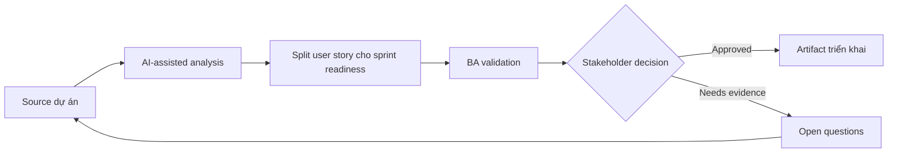

# Split user story cho sprint readiness

<div class="case-meta">
  <span>Requirements and backlog</span>
  <span>Agile delivery</span>
  <span>Use case dự án</span>
</div>

## Project context

Một delivery squad nhận feature idea lớn: cho phép business customer quản lý billing contact và notification preference. Product owner muốn đưa vào sprint tới, nhưng developer không estimate được vì scope và rule đang trộn lẫn. Trong môi trường delivery thật, tình huống này thường xuất hiện dưới áp lực thời gian: stakeholder cần clarity, delivery cần backlog, QA cần behavior test được, operations cần process chịu được exception. BA dùng AI để tăng tốc analysis và synthesis, nhưng BA vẫn chịu trách nhiệm về evidence, business meaning, stakeholder decisioning và artifact quality.

## BA challenge

BA phải split feature thành story theo user goal, có boundary, dependency, acceptance criteria, negative case và release order rõ. AI có thể đề xuất story split, nhưng BA phải validate business value và technical dependency với squad. Khó khăn thực tế là AI có thể làm material ban đầu trông hoàn chỉnh hơn mức thật sự. BA giỏi giữ output ở trạng thái reviewable bằng cách tách source-backed fact, assumption, unsupported claim, decision gap và recommended next action. Mục tiêu không phải làm document dài hơn; mục tiêu là làm project decision rõ hơn và an toàn hơn.

## Where AI fits

<div class="ba-workbench-panel">
AI hữu ích trong use case này khi được giới hạn vào analysis support, pattern detection, structured drafting và critique. AI không được approve scope, invent policy, quyết định business trade-off hoặc thay thế judgment của stakeholder chịu trách nhiệm.
</div>

- Generate split option theo actor, workflow step, rule variation và data boundary.
- Draft Given-When-Then acceptance criteria cho từng candidate story.
- Suggest dependency và release sequencing risk.
- Identify negative, permission và audit scenario.

## Inputs to prepare

- Feature idea
- Actor và permission model
- Current billing process
- Known business rule
- Technical dependency notes

BA nên label các input này trước khi dùng AI: source owner, source date, approval status, sensitivity level, và source đó là fact, opinion, policy, draft hay historical evidence. Việc chuẩn bị này ngăn model xem mọi input đều current và authoritative như nhau.

## BA workflow

1. Yêu cầu AI đề xuất nhiều splitting strategy và giải thích trade-off.
2. Reject split chỉ dựa vào UI component nếu không deliver user value.
3. Map mỗi story với một user goal và một testable outcome.
4. Thêm acceptance criteria, negative case, audit expectation và permission.
5. Review sequence với developer và QA.
6. Publish story sprint-ready có dependency và open decision.

Workflow hiệu quả nhất khi dùng AI theo từng stage: trước hết organize evidence, sau đó yêu cầu analysis, tiếp theo tạo artifact, rồi chạy critique pass. BA nên giữ decision log visible xuyên suốt để suggestion do AI sinh ra không âm thầm trở thành approved scope.

## Diagram



## Deliverables

| Deliverable | Nội dung | Owner | Done signal |
| --- | --- | --- | --- |
| Story split map | Candidate story group theo actor, goal, dependency và release order | BA | Mỗi story có user value độc lập |
| Acceptance criteria set | Given-When-Then criteria có positive, negative và boundary case | BA và QA | QA design test không phải đoán |
| Dependency notes | Technical, data, policy và workflow dependency | Tech lead | Dependency visible trước sprint planning |
| Open decision list | Rule chưa resolve và owner | Product owner | Không story nào vào sprint với hidden business rule gap |

Các deliverable này nên được xem là artifact do BA own. AI có thể draft, nhưng BA phải validate source support, stakeholder meaning, traceability và artifact đã sẵn sàng handoff hay chưa.

## Prompt to try

```text
Hãy đóng vai senior Business Analyst hiểu AI. Hỗ trợ tôi áp dụng use case "Split user story cho sprint readiness" vào dự án. Trước hết hỏi source evidence và constraint. Sau đó tạo structured analysis gồm project context, assumption, AI-fit boundary, workflow step, deliverable, risk, control, open question và stakeholder decision. Không tự bịa policy, threshold hoặc approval.
```

## Review checklist

- Mọi statement do AI hỗ trợ đều gắn với source, assumption hoặc validation question.
- BA đã tách drafting assistance khỏi business approval.
- Workflow step có human owner cho decision, review và exception.
- Deliverable trace được về project input và review được bởi QA, product hoặc operations.
- Risk control đủ thực tế để dùng trong meeting dự án thật.
- Success metric: Sprint planning nhận story mà QA và developer có thể estimate, test và release theo increment có ý nghĩa.

## Risks and controls

| Rủi ro | Vì sao quan trọng | Control của BA |
| --- | --- | --- |
| Component slicing | Story có thể align theo UI piece thay vì user outcome | Evaluate từng split theo user goal và release value |
| Overloaded story | Một story có nhiều actor hoặc rule set | Giới hạn mỗi story vào một actor goal và outcome rõ |
| Missing negative cases | Happy-path story pass nhưng user thật fail | Yêu cầu permission, boundary và error scenario |
| Unestimated dependency | Integration work ẩn có thể disrupt sprint | Review dependency với engineering trước commitment |

Control quan trọng nhất là làm uncertainty visible. Nếu evidence yếu, output nên tạo validation question hoặc decision item, không phải final requirement. Nếu artifact ảnh hưởng delivery, release, compliance, customer experience hoặc operational workload, BA nên yêu cầu human review explicit trước khi handoff.
