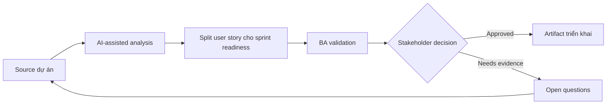

# Split user story cho sprint readiness

<div class="case-meta">
  <span>Requirements and backlog</span>
  <span>Agile delivery</span>
  <span>Use case dự án</span>
</div>

## Project context

Một delivery squad nhận feature idea lớn: cho phép business customer quản lý billing contact và notification preference. Product owner muốn đưa vào sprint tới, nhưng developer không estimate được vì scope và rule đang trộn lẫn. Trong Agile delivery, công việc này thường bắt đầu khi story phải test được mà không mất business rule, exception, data need hoặc NFR. BA nên xem Feature idea và Actor và permission model là evidence cần organize, không phải raw material để AI trả lời không kiểm soát. Mục tiêu là làm decision tiếp theo rõ hơn cho người own outcome.

## BA challenge

BA phải split feature thành story theo user goal, có boundary, dependency, acceptance criteria, negative case và release order rõ. AI có thể đề xuất story split, nhưng BA phải validate business value và technical dependency với squad. Với Split user story cho sprint readiness, khó khăn thực tế là criteria mơ hồ và assumption không owner. AI có thể tăng tốc gap finding, rewrite critique, edge-case expansion và acceptance-criteria drafting, nhưng BA vẫn phải làm rõ assumption, approval còn thiếu và điểm cần stakeholder judgment.

## Where AI fits

<div class="ba-workbench-panel">
AI phù hợp với use case Requirements và backlog khi được giới hạn vào gap finding, rewrite critique, edge-case expansion và acceptance-criteria drafting. AI task hữu ích đầu tiên là: Generate split option theo actor, workflow step, rule variation và data boundary. AI không được approve scope, invent policy, bỏ qua rule đã approve, example, edge case và expectation của QA, hoặc biến draft thành final decision.
</div>

- Generate split option theo actor, workflow step, rule variation và data boundary.
- Draft Given-When-Then acceptance criteria cho từng candidate story.
- Suggest dependency và release sequencing risk.
- Identify negative, permission và audit scenario.

## Inputs to prepare

- Feature idea
- Actor và permission model
- Current billing process
- Known business rule
- Technical dependency notes

Trước khi prompt cho Split user story cho sprint readiness, hãy label từng input theo owner, date, approval status, sensitivity và vai trò trong decision. Evidence lens quan trọng nhất là rule đã approve, example, edge case và expectation của QA; nếu thiếu, AI có thể xem old note, draft design và approved rule có authority như nhau.

## BA workflow

1. Yêu cầu AI đề xuất nhiều splitting strategy và giải thích trade-off.
2. Reject split chỉ dựa vào UI component nếu không deliver user value.
3. Map mỗi story với một user goal và một testable outcome.
4. Thêm acceptance criteria, negative case, audit expectation và permission.
5. Review sequence với developer và QA.
6. Publish story sprint-ready có dependency và open decision.

Chạy workflow như clarify requirement trước khi commit sprint: bắt đầu với "Yêu cầu AI đề xuất nhiều splitting strategy và giải thích trade-off.", sau đó giữ decision log visible khi artifact tiến tới Story split map. Cách này ngăn suggestion của AI âm thầm trở thành backlog, design, release hoặc operational commitment.

## Diagram



## Deliverables

| Deliverable | Nội dung | Owner | Done signal |
| --- | --- | --- | --- |
| Story split map | Candidate story group theo actor, goal, dependency và release order | BA | Mỗi story có user value độc lập |
| Acceptance criteria set | Given-When-Then criteria có positive, negative và boundary case | BA và QA | QA design test không phải đoán |
| Dependency notes | Technical, data, policy và workflow dependency | Tech lead | Dependency visible trước sprint planning |
| Open decision list | Rule chưa resolve và owner | Product owner | Không story nào vào sprint với hidden business rule gap |

Hãy xem Story split map là delivery-ready backlog artifact do BA own. AI có thể draft structure, nhưng BA phải validate "Mỗi story có user value độc lập" có thật sự đúng không, artifact có trace được về evidence không và receiving team có hành động được không.

## Prompt to try

```text
Hãy đóng vai senior Business Analyst hiểu AI. Hỗ trợ tôi áp dụng use case "Split user story cho sprint readiness" vào dự án. Trước hết hỏi source evidence và constraint. Sau đó tạo structured analysis gồm project context, assumption, AI-fit boundary, workflow step, deliverable, risk, control, open question và stakeholder decision. Không tự bịa policy, threshold hoặc approval.
```

## Review checklist

- Feature idea được label owner, date, approval status và sensitivity.
- Story split map trace được về source evidence và có human owner rõ.
- AI task nằm trong boundary gap finding, rewrite critique, edge-case expansion và acceptance-criteria drafting và không approve scope hoặc policy.
- Risk "Component slicing" có control thực tế: Evaluate từng split theo user goal và release value.
- Open assumption được chuyển thành validation question hoặc stakeholder decision.
- Success metric: Sprint planning nhận story mà QA và developer có thể estimate, test và release theo increment có ý nghĩa.

## Risks and controls

| Rủi ro | Vì sao quan trọng | Control của BA |
| --- | --- | --- |
| Component slicing | Story có thể align theo UI piece thay vì user outcome | Evaluate từng split theo user goal và release value |
| Overloaded story | Một story có nhiều actor hoặc rule set | Giới hạn mỗi story vào một actor goal và outcome rõ |
| Missing negative cases | Happy-path story pass nhưng user thật fail | Yêu cầu permission, boundary và error scenario |
| Unestimated dependency | Integration work ẩn có thể disrupt sprint | Review dependency với engineering trước commitment |

Control chính cho risk "Component slicing" là human accountability explicit: Evaluate từng split theo user goal và release value. Nếu evidence yếu, output nên tạo validation question hoặc decision item, không phải final requirement.
