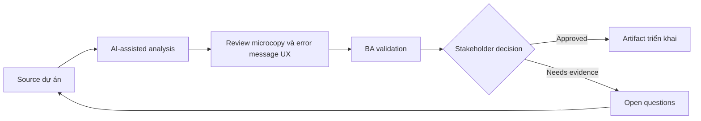

# Review microcopy và error message UX

<div class="case-meta">
  <span>Frontend, UI, and UX</span>
  <span>UX writing</span>
  <span>Frontend/UI refinement</span>
  <span>Practitioner</span>
  <span>Message catalog</span>
  <span>Use case dự án</span>
</div>

## Project context

Signup flow có nhiều validation error, consent message, confirmation dialog và success state. Wording inconsistent và một số message đổ lỗi user hoặc che next step. Trong UX writing, công việc này thường bắt đầu khi screen behavior, accessibility, design state, analytics và user feedback phải thành requirement implement được. BA nên xem UI copy list và Validation rules là evidence cần organize, không phải raw material để AI trả lời không kiểm soát. Mục tiêu là làm decision tiếp theo rõ hơn cho người own outcome.

## BA challenge

BA phải hỗ trợ UX và product đảm bảo copy phản ánh business rule, compliance, user recovery và system truth. AI có thể draft copy option, nhưng BA phải validate accuracy và decision implication. Với Review microcopy và error message UX, khó khăn thực tế là missing state và UX không đo được. AI có thể tăng tốc UI-state analysis, content critique, accessibility review, event taxonomy và edge-case discovery, nhưng BA vẫn phải làm rõ assumption, approval còn thiếu và điểm cần stakeholder judgment.

## Where AI fits

<div class="ba-workbench-panel">
AI phù hợp với use case Frontend, UI và UX khi được giới hạn vào UI-state analysis, content critique, accessibility review, event taxonomy và edge-case discovery. AI task hữu ích đầu tiên là: Generate copy variant cho error, confirmation, empty state và success message. AI không được approve scope, invent policy, bỏ qua wireframe, design token, user journey, analytics question và accessibility expectation, hoặc biến draft thành final decision.
</div>

- Generate copy variant cho error, confirmation, empty state và success message.
- Critique copy theo clarity, blame, compliance risk và recovery guidance.
- Map từng message với trigger, rule và user next action.
- Tạo localized copy review question.

## Inputs to prepare

- UI copy list
- Validation rules
- Compliance wording constraints
- Brand voice guide
- User research notes

Trước khi prompt cho Review microcopy và error message UX, hãy label từng input theo owner, date, approval status, sensitivity và vai trò trong decision. Evidence lens quan trọng nhất là wireframe, design token, user journey, analytics question và accessibility expectation; nếu thiếu, AI có thể xem old note, draft design và approved rule có authority như nhau.

## BA workflow

1. Inventory message theo screen, trigger và user state.
2. Yêu cầu AI critique clarity và recovery guidance của message.
3. Generate alternative copy option nhưng không đổi business meaning.
4. Validate wording regulated hoặc sensitive với legal/compliance owner.
5. Map từng message tới rule, source và acceptance criteria.
6. Prepare copy handoff cho frontend và localization.

Chạy workflow như screen-state review trước frontend build: bắt đầu với "Inventory message theo screen, trigger và user state.", sau đó giữ decision log visible khi artifact tiến tới Message catalog. Cách này ngăn suggestion của AI âm thầm trở thành backlog, design, release hoặc operational commitment.

## Diagram



## Deliverables

| Deliverable | Nội dung | Owner | Done signal |
| --- | --- | --- | --- |
| Message catalog | Screen, trigger, current copy, proposed copy, rule và owner | BA và UX writer | Mọi message có trigger và source |
| Recovery guidance matrix | Error, user action, system action và support path | BA | User biết next step |
| Compliance copy review | Sensitive message, constraint, reviewer và approval status | Compliance | Regulated copy approved |
| Localization notes | Variable, tone, length và translation risk | Localization owner | Copy localize an toàn |

Hãy xem Message catalog là frontend requirement specification do BA own. AI có thể draft structure, nhưng BA phải validate "Mọi message có trigger và source" có thật sự đúng không, artifact có trace được về evidence không và receiving team có hành động được không.

## Prompt to try

```text
Hãy đóng vai senior Business Analyst hiểu AI. Hỗ trợ tôi áp dụng use case "Review microcopy và error message UX" vào dự án. Trước hết hỏi source evidence và constraint. Sau đó tạo structured analysis gồm project context, assumption, AI-fit boundary, workflow step, deliverable, risk, control, open question và stakeholder decision. Không tự bịa policy, threshold hoặc approval.
```

## Review checklist

- UI copy list được label owner, date, approval status và sensitivity.
- Message catalog trace được về source evidence và có human owner rõ.
- AI task nằm trong boundary UI-state analysis, content critique, accessibility review, event taxonomy và edge-case discovery và không approve scope hoặc policy.
- Risk "Misleading copy" có control thực tế: Map copy với source rule.
- Open assumption được chuyển thành validation question hoặc stakeholder decision.
- Success metric: UI copy trở nên accurate, recoverable, testable và ready cho localization.

## Risks and controls

| Rủi ro | Vì sao quan trọng | Control của BA |
| --- | --- | --- |
| Misleading copy | Wording thân thiện có thể che rule hoặc risk quan trọng | Map copy với source rule |
| User blame | Message có thể làm user frustrate | Dùng language neutral và recovery-focused |
| Compliance drift | AI có thể rewrite wording regulated sai | Require compliance approval |
| Localization breakage | Copy có thể không fit UI khi translate | Track variable và length constraint |

Control chính cho risk "Misleading copy" là human accountability explicit: Map copy với source rule. Nếu evidence yếu, output nên tạo validation question hoặc decision item, không phải final requirement.
