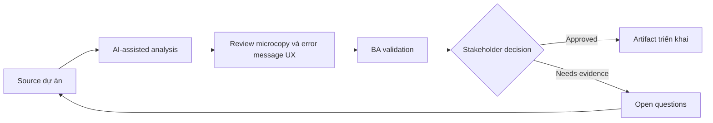

# Review microcopy và error message UX

<div class="case-meta">
  <span>Frontend, UI, and UX</span>
  <span>UX writing</span>
  <span>Use case dự án</span>
</div>

## Project context

Signup flow có nhiều validation error, consent message, confirmation dialog và success state. Wording inconsistent và một số message đổ lỗi user hoặc che next step. Trong môi trường delivery thật, tình huống này thường xuất hiện dưới áp lực thời gian: stakeholder cần clarity, delivery cần backlog, QA cần behavior test được, operations cần process chịu được exception. BA dùng AI để tăng tốc analysis và synthesis, nhưng BA vẫn chịu trách nhiệm về evidence, business meaning, stakeholder decisioning và artifact quality.

## BA challenge

BA phải hỗ trợ UX và product đảm bảo copy phản ánh business rule, compliance, user recovery và system truth. AI có thể draft copy option, nhưng BA phải validate accuracy và decision implication. Khó khăn thực tế là AI có thể làm material ban đầu trông hoàn chỉnh hơn mức thật sự. BA giỏi giữ output ở trạng thái reviewable bằng cách tách source-backed fact, assumption, unsupported claim, decision gap và recommended next action. Mục tiêu không phải làm document dài hơn; mục tiêu là làm project decision rõ hơn và an toàn hơn.

## Where AI fits

<div class="ba-workbench-panel">
AI hữu ích trong use case này khi được giới hạn vào analysis support, pattern detection, structured drafting và critique. AI không được approve scope, invent policy, quyết định business trade-off hoặc thay thế judgment của stakeholder chịu trách nhiệm.
</div>

- Generate copy variant cho error, confirmation, empty state và success message.
- Critique copy theo clarity, blame, compliance risk và recovery guidance.
- Map từng message với trigger, rule và user next action.
- Tạo localized copy review question.

## Inputs to prepare

- UI copy list
- Validation rules
- Compliance wording constraints
- Brand voice guide
- User research notes

BA nên label các input này trước khi dùng AI: source owner, source date, approval status, sensitivity level, và source đó là fact, opinion, policy, draft hay historical evidence. Việc chuẩn bị này ngăn model xem mọi input đều current và authoritative như nhau.

## BA workflow

1. Inventory message theo screen, trigger và user state.
2. Yêu cầu AI critique clarity và recovery guidance của message.
3. Generate alternative copy option nhưng không đổi business meaning.
4. Validate wording regulated hoặc sensitive với legal/compliance owner.
5. Map từng message tới rule, source và acceptance criteria.
6. Prepare copy handoff cho frontend và localization.

Workflow hiệu quả nhất khi dùng AI theo từng stage: trước hết organize evidence, sau đó yêu cầu analysis, tiếp theo tạo artifact, rồi chạy critique pass. BA nên giữ decision log visible xuyên suốt để suggestion do AI sinh ra không âm thầm trở thành approved scope.

## Diagram



## Deliverables

| Deliverable | Nội dung | Owner | Done signal |
| --- | --- | --- | --- |
| Message catalog | Screen, trigger, current copy, proposed copy, rule và owner | BA và UX writer | Mọi message có trigger và source |
| Recovery guidance matrix | Error, user action, system action và support path | BA | User biết next step |
| Compliance copy review | Sensitive message, constraint, reviewer và approval status | Compliance | Regulated copy approved |
| Localization notes | Variable, tone, length và translation risk | Localization owner | Copy localize an toàn |

Các deliverable này nên được xem là artifact do BA own. AI có thể draft, nhưng BA phải validate source support, stakeholder meaning, traceability và artifact đã sẵn sàng handoff hay chưa.

## Prompt to try

```text
Hãy đóng vai senior Business Analyst hiểu AI. Hỗ trợ tôi áp dụng use case "Review microcopy và error message UX" vào dự án. Trước hết hỏi source evidence và constraint. Sau đó tạo structured analysis gồm project context, assumption, AI-fit boundary, workflow step, deliverable, risk, control, open question và stakeholder decision. Không tự bịa policy, threshold hoặc approval.
```

## Review checklist

- Mọi statement do AI hỗ trợ đều gắn với source, assumption hoặc validation question.
- BA đã tách drafting assistance khỏi business approval.
- Workflow step có human owner cho decision, review và exception.
- Deliverable trace được về project input và review được bởi QA, product hoặc operations.
- Risk control đủ thực tế để dùng trong meeting dự án thật.
- Success metric: UI copy trở nên accurate, recoverable, testable và ready cho localization.

## Risks and controls

| Rủi ro | Vì sao quan trọng | Control của BA |
| --- | --- | --- |
| Misleading copy | Wording thân thiện có thể che rule hoặc risk quan trọng | Map copy với source rule |
| User blame | Message có thể làm user frustrate | Dùng language neutral và recovery-focused |
| Compliance drift | AI có thể rewrite wording regulated sai | Require compliance approval |
| Localization breakage | Copy có thể không fit UI khi translate | Track variable và length constraint |

Control quan trọng nhất là làm uncertainty visible. Nếu evidence yếu, output nên tạo validation question hoặc decision item, không phải final requirement. Nếu artifact ảnh hưởng delivery, release, compliance, customer experience hoặc operational workload, BA nên yêu cầu human review explicit trước khi handoff.
