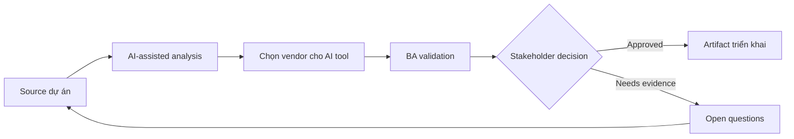

# Chọn vendor cho AI tool

<div class="case-meta">
  <span>Governance and adoption</span>
  <span>Vendor evaluation</span>
  <span>Use case dự án</span>
</div>

## Project context

Một BA practice evaluate AI tool cho requirements drafting, meeting synthesis, document review và internal knowledge search. Vendor promise productivity gain, nhưng compliance và IT lo data leakage và governance. Trong Vendor evaluation, công việc này thường bắt đầu khi cách dùng AI phải scale qua nhiều team mà không leak sensitive data hoặc tạo decision không review được. BA nên xem BA use-case portfolio và Security requirements là evidence cần organize, không phải raw material để AI trả lời không kiểm soát. Mục tiêu là làm decision tiếp theo rõ hơn cho người own outcome.

## BA challenge

BA lead phải define evaluation criteria cover use-case fit, data handling, security, audit, model behavior, integration, admin control, cost và adoption support. AI có thể hỗ trợ compare vendor claim, nhưng claim phải verify. Với Chọn vendor cho AI tool, khó khăn thực tế là shadow AI use và accountability yếu. AI có thể tăng tốc portfolio analysis, policy drafting, risk-tiering, playbook creation và adoption measurement, nhưng BA vẫn phải làm rõ assumption, approval còn thiếu và điểm cần stakeholder judgment.

## Where AI fits

<div class="ba-workbench-panel">
AI phù hợp với use case Governance và adoption khi được giới hạn vào portfolio analysis, policy drafting, risk-tiering, playbook creation và adoption measurement. AI task hữu ích đầu tiên là: Build vendor scorecard từ BA use case và risk tier. AI không được approve scope, invent policy, bỏ qua data policy, approved tool, risk appetite, audit need và capability của team, hoặc biến draft thành final decision.
</div>

- Build vendor scorecard từ BA use case và risk tier.
- Extract vendor claim và map với required evidence.
- Generate demo script và validation question.
- Draft pilot success metric và governance gate.

## Inputs to prepare

- BA use-case portfolio
- Security requirements
- Vendor documentation
- Procurement criteria
- Compliance policy

Trước khi prompt cho Chọn vendor cho AI tool, hãy label từng input theo owner, date, approval status, sensitivity và vai trò trong decision. Evidence lens quan trọng nhất là data policy, approved tool, risk appetite, audit need và capability của team; nếu thiếu, AI có thể xem old note, draft design và approved rule có authority như nhau.

## BA workflow

1. Define approved BA use case và prohibited data trước vendor demo.
2. Yêu cầu AI tạo weighted scorecard theo value và risk.
3. Map vendor claim tới evidence required: documentation, demo, contract hoặc security review.
4. Tạo scenario-based demo script dùng workflow BA thật.
5. Run pilot evaluation với quality, cycle time và risk metric.
6. Prepare recommendation có condition và rollout control.

Chạy workflow như governance design trước rollout rộng: bắt đầu với "Define approved BA use case và prohibited data trước vendor demo.", sau đó giữ decision log visible khi artifact tiến tới Vendor scorecard. Cách này ngăn suggestion của AI âm thầm trở thành backlog, design, release hoặc operational commitment.

## Diagram



## Deliverables

| Deliverable | Nội dung | Owner | Done signal |
| --- | --- | --- | --- |
| Vendor scorecard | Criteria, weight, evidence, score và risk note | BA lead và procurement | Score evidence-based |
| Demo script | BA workflow, test data, expected output và failure check | BA lead | Demo test real work |
| Security and governance checklist | Data, retention, audit, admin, access và compliance control | IT và compliance | Risk được review |
| Pilot success plan | Metric, participant, use case, quality gate và decision criteria | Sponsor | Pilot tạo được decision |

Hãy xem Vendor scorecard là AI adoption control pack do BA own. AI có thể draft structure, nhưng BA phải validate "Score evidence-based" có thật sự đúng không, artifact có trace được về evidence không và receiving team có hành động được không.

## Prompt to try

```text
Hãy đóng vai senior Business Analyst hiểu AI. Hỗ trợ tôi áp dụng use case "Chọn vendor cho AI tool" vào dự án. Trước hết hỏi source evidence và constraint. Sau đó tạo structured analysis gồm project context, assumption, AI-fit boundary, workflow step, deliverable, risk, control, open question và stakeholder decision. Không tự bịa policy, threshold hoặc approval.
```

## Review checklist

- BA use-case portfolio được label owner, date, approval status và sensitivity.
- Vendor scorecard trace được về source evidence và có human owner rõ.
- AI task nằm trong boundary portfolio analysis, policy drafting, risk-tiering, playbook creation và adoption measurement và không approve scope hoặc policy.
- Risk "Vendor-led scope" có control thực tế: Start từ BA use case và risk tier.
- Open assumption được chuyển thành validation question hoặc stakeholder decision.
- Success metric: Vendor selection được drive bởi BA workflow value, verified control và pilot evidence.

## Risks and controls

| Rủi ro | Vì sao quan trọng | Control của BA |
| --- | --- | --- |
| Vendor-led scope | Demo có thể shape requirement trước khi BA define need | Start từ BA use case và risk tier |
| Unverified claims | Marketing statement có thể không reflect capability thật | Require evidence type cho từng claim |
| Data leakage | Tool có thể process confidential data không an toàn | Review data handling và approved-use policy |
| Adoption theater | User có thể thử tool nhưng quality không cải thiện | Measure artifact quality và rework, không chỉ usage |

Control chính cho risk "Vendor-led scope" là human accountability explicit: Start từ BA use case và risk tier. Nếu evidence yếu, output nên tạo validation question hoặc decision item, không phải final requirement.
