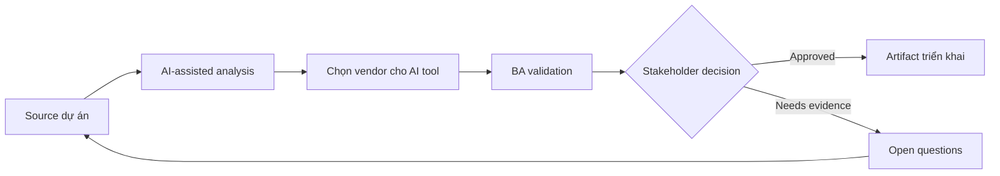

# Chọn vendor cho AI tool

<div class="case-meta">
  <span>Governance and adoption</span>
  <span>Vendor evaluation</span>
  <span>Use case dự án</span>
</div>

## Project context

Một BA practice evaluate AI tool cho requirements drafting, meeting synthesis, document review và internal knowledge search. Vendor promise productivity gain, nhưng compliance và IT lo data leakage và governance. Trong môi trường delivery thật, tình huống này thường xuất hiện dưới áp lực thời gian: stakeholder cần clarity, delivery cần backlog, QA cần behavior test được, operations cần process chịu được exception. BA dùng AI để tăng tốc analysis và synthesis, nhưng BA vẫn chịu trách nhiệm về evidence, business meaning, stakeholder decisioning và artifact quality.

## BA challenge

BA lead phải define evaluation criteria cover use-case fit, data handling, security, audit, model behavior, integration, admin control, cost và adoption support. AI có thể hỗ trợ compare vendor claim, nhưng claim phải verify. Khó khăn thực tế là AI có thể làm material ban đầu trông hoàn chỉnh hơn mức thật sự. BA giỏi giữ output ở trạng thái reviewable bằng cách tách source-backed fact, assumption, unsupported claim, decision gap và recommended next action. Mục tiêu không phải làm document dài hơn; mục tiêu là làm project decision rõ hơn và an toàn hơn.

## Where AI fits

<div class="ba-workbench-panel">
AI hữu ích trong use case này khi được giới hạn vào analysis support, pattern detection, structured drafting và critique. AI không được approve scope, invent policy, quyết định business trade-off hoặc thay thế judgment của stakeholder chịu trách nhiệm.
</div>

- Build vendor scorecard từ BA use case và risk tier.
- Extract vendor claim và map với required evidence.
- Generate demo script và validation question.
- Draft pilot success metric và governance gate.

## Inputs to prepare

- BA use-case portfolio
- Security requirements
- Vendor documentation
- Procurement criteria
- Compliance policy

BA nên label các input này trước khi dùng AI: source owner, source date, approval status, sensitivity level, và source đó là fact, opinion, policy, draft hay historical evidence. Việc chuẩn bị này ngăn model xem mọi input đều current và authoritative như nhau.

## BA workflow

1. Define approved BA use case và prohibited data trước vendor demo.
2. Yêu cầu AI tạo weighted scorecard theo value và risk.
3. Map vendor claim tới evidence required: documentation, demo, contract hoặc security review.
4. Tạo scenario-based demo script dùng workflow BA thật.
5. Run pilot evaluation với quality, cycle time và risk metric.
6. Prepare recommendation có condition và rollout control.

Workflow hiệu quả nhất khi dùng AI theo từng stage: trước hết organize evidence, sau đó yêu cầu analysis, tiếp theo tạo artifact, rồi chạy critique pass. BA nên giữ decision log visible xuyên suốt để suggestion do AI sinh ra không âm thầm trở thành approved scope.

## Diagram



## Deliverables

| Deliverable | Nội dung | Owner | Done signal |
| --- | --- | --- | --- |
| Vendor scorecard | Criteria, weight, evidence, score và risk note | BA lead và procurement | Score evidence-based |
| Demo script | BA workflow, test data, expected output và failure check | BA lead | Demo test real work |
| Security and governance checklist | Data, retention, audit, admin, access và compliance control | IT và compliance | Risk được review |
| Pilot success plan | Metric, participant, use case, quality gate và decision criteria | Sponsor | Pilot tạo được decision |

Các deliverable này nên được xem là artifact do BA own. AI có thể draft, nhưng BA phải validate source support, stakeholder meaning, traceability và artifact đã sẵn sàng handoff hay chưa.

## Prompt to try

```text
Hãy đóng vai senior Business Analyst hiểu AI. Hỗ trợ tôi áp dụng use case "Chọn vendor cho AI tool" vào dự án. Trước hết hỏi source evidence và constraint. Sau đó tạo structured analysis gồm project context, assumption, AI-fit boundary, workflow step, deliverable, risk, control, open question và stakeholder decision. Không tự bịa policy, threshold hoặc approval.
```

## Review checklist

- Mọi statement do AI hỗ trợ đều gắn với source, assumption hoặc validation question.
- BA đã tách drafting assistance khỏi business approval.
- Workflow step có human owner cho decision, review và exception.
- Deliverable trace được về project input và review được bởi QA, product hoặc operations.
- Risk control đủ thực tế để dùng trong meeting dự án thật.
- Success metric: Vendor selection được drive bởi BA workflow value, verified control và pilot evidence.

## Risks and controls

| Rủi ro | Vì sao quan trọng | Control của BA |
| --- | --- | --- |
| Vendor-led scope | Demo có thể shape requirement trước khi BA define need | Start từ BA use case và risk tier |
| Unverified claims | Marketing statement có thể không reflect capability thật | Require evidence type cho từng claim |
| Data leakage | Tool có thể process confidential data không an toàn | Review data handling và approved-use policy |
| Adoption theater | User có thể thử tool nhưng quality không cải thiện | Measure artifact quality và rework, không chỉ usage |

Control quan trọng nhất là làm uncertainty visible. Nếu evidence yếu, output nên tạo validation question hoặc decision item, không phải final requirement. Nếu artifact ảnh hưởng delivery, release, compliance, customer experience hoặc operational workload, BA nên yêu cầu human review explicit trước khi handoff.
