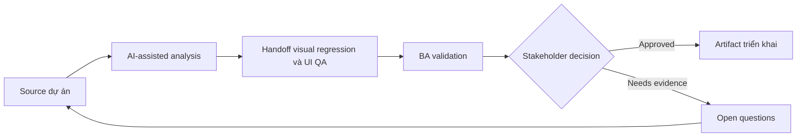

# Handoff visual regression và UI QA

<div class="case-meta">
  <span>Frontend, UI, and UX</span>
  <span>Visual QA</span>
  <span>Use case dự án</span>
</div>

## Project context

Một redesign update shared component trên nhiều page. Team cần QA guidance cho visual regression, layout shift, browser difference và component variant. Trong môi trường delivery thật, tình huống này thường xuất hiện dưới áp lực thời gian: stakeholder cần clarity, delivery cần backlog, QA cần behavior test được, operations cần process chịu được exception. BA dùng AI để tăng tốc analysis và synthesis, nhưng BA vẫn chịu trách nhiệm về evidence, business meaning, stakeholder decisioning và artifact quality.

## BA challenge

BA phải giúp define visual quality theo business term: critical page, supported browser, responsive state, component variant và acceptable deviation. AI có thể draft checklist, nhưng visual decision cần design ownership. Khó khăn thực tế là AI có thể làm material ban đầu trông hoàn chỉnh hơn mức thật sự. BA giỏi giữ output ở trạng thái reviewable bằng cách tách source-backed fact, assumption, unsupported claim, decision gap và recommended next action. Mục tiêu không phải làm document dài hơn; mục tiêu là làm project decision rõ hơn và an toàn hơn.

## Where AI fits

<div class="ba-workbench-panel">
AI hữu ích trong use case này khi được giới hạn vào analysis support, pattern detection, structured drafting và critique. AI không được approve scope, invent policy, quyết định business trade-off hoặc thay thế judgment của stakeholder chịu trách nhiệm.
</div>

- Generate visual QA checklist từ redesign scope.
- Identify critical page và component variant cần coverage.
- Draft browser và viewport matrix theo risk.
- Tạo defect severity rubric cho visual issue.

## Inputs to prepare

- Redesign scope
- Component inventory
- Critical page list
- Supported browser policy
- Design acceptance notes

BA nên label các input này trước khi dùng AI: source owner, source date, approval status, sensitivity level, và source đó là fact, opinion, policy, draft hay historical evidence. Việc chuẩn bị này ngăn model xem mọi input đều current và authoritative như nhau.

## BA workflow

1. Inventory affected page, component, variant và viewport.
2. Yêu cầu AI propose visual QA coverage và severity category.
3. Review coverage với UX, frontend và QA.
4. Define acceptable deviation, critical defect và release blocker.
5. Thêm screenshot hoặc baseline expectation khi hữu ích.
6. Publish visual QA handoff và defect triage rule.

Workflow hiệu quả nhất khi dùng AI theo từng stage: trước hết organize evidence, sau đó yêu cầu analysis, tiếp theo tạo artifact, rồi chạy critique pass. BA nên giữ decision log visible xuyên suốt để suggestion do AI sinh ra không âm thầm trở thành approved scope.

## Diagram



## Deliverables

| Deliverable | Nội dung | Owner | Done signal |
| --- | --- | --- | --- |
| Visual QA matrix | Page, component, variant, viewport, browser và priority | BA và QA | Coverage risk-based |
| Severity rubric | Visual issue type, user impact, severity và release decision | Product và UX | Triage consistent |
| Baseline checklist | Expected layout, spacing, overflow và interaction state | UX | Design intent test được |
| Regression triage board | Defect, affected page, severity, owner và decision | QA lead | Visual defect được manage |

Các deliverable này nên được xem là artifact do BA own. AI có thể draft, nhưng BA phải validate source support, stakeholder meaning, traceability và artifact đã sẵn sàng handoff hay chưa.

## Prompt to try

```text
Hãy đóng vai senior Business Analyst hiểu AI. Hỗ trợ tôi áp dụng use case "Handoff visual regression và UI QA" vào dự án. Trước hết hỏi source evidence và constraint. Sau đó tạo structured analysis gồm project context, assumption, AI-fit boundary, workflow step, deliverable, risk, control, open question và stakeholder decision. Không tự bịa policy, threshold hoặc approval.
```

## Review checklist

- Mọi statement do AI hỗ trợ đều gắn với source, assumption hoặc validation question.
- BA đã tách drafting assistance khỏi business approval.
- Workflow step có human owner cho decision, review và exception.
- Deliverable trace được về project input và review được bởi QA, product hoặc operations.
- Risk control đủ thực tế để dùng trong meeting dự án thật.
- Success metric: Visual QA tập trung regression ảnh hưởng user trên critical page, component và supported viewport.

## Risks and controls

| Rủi ro | Vì sao quan trọng | Control của BA |
| --- | --- | --- |
| Subjective defects | Mọi người có thể không thống nhất visual issue có quan trọng không | Dùng severity rubric gắn với user impact |
| Coverage gaps | Shared component change có thể break page ẩn | Inventory page và component variant |
| Browser surprise | Layout có thể fail chỉ ở supported browser | Define browser và viewport matrix |
| Design drift | Implementation có thể dần lệch system rule | Dùng baseline checklist và design review |

Control quan trọng nhất là làm uncertainty visible. Nếu evidence yếu, output nên tạo validation question hoặc decision item, không phải final requirement. Nếu artifact ảnh hưởng delivery, release, compliance, customer experience hoặc operational workload, BA nên yêu cầu human review explicit trước khi handoff.
