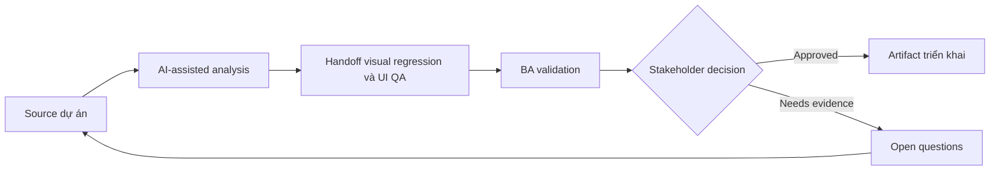

# Handoff visual regression và UI QA

<div class="case-meta">
  <span>Frontend, UI, and UX</span>
  <span>Visual QA</span>
  <span>Use case dự án</span>
</div>

## Project context

Một redesign update shared component trên nhiều page. Team cần QA guidance cho visual regression, layout shift, browser difference và component variant. Trong Visual QA, công việc này thường bắt đầu khi screen behavior, accessibility, design state, analytics và user feedback phải thành requirement implement được. BA nên xem Redesign scope và Component inventory là evidence cần organize, không phải raw material để AI trả lời không kiểm soát. Mục tiêu là làm decision tiếp theo rõ hơn cho người own outcome.

## BA challenge

BA phải giúp define visual quality theo business term: critical page, supported browser, responsive state, component variant và acceptable deviation. AI có thể draft checklist, nhưng visual decision cần design ownership. Với Handoff visual regression và UI QA, khó khăn thực tế là missing state và UX không đo được. AI có thể tăng tốc UI-state analysis, content critique, accessibility review, event taxonomy và edge-case discovery, nhưng BA vẫn phải làm rõ assumption, approval còn thiếu và điểm cần stakeholder judgment.

## Where AI fits

<div class="ba-workbench-panel">
AI phù hợp với use case Frontend, UI và UX khi được giới hạn vào UI-state analysis, content critique, accessibility review, event taxonomy và edge-case discovery. AI task hữu ích đầu tiên là: Generate visual QA checklist từ redesign scope. AI không được approve scope, invent policy, bỏ qua wireframe, design token, user journey, analytics question và accessibility expectation, hoặc biến draft thành final decision.
</div>

- Generate visual QA checklist từ redesign scope.
- Identify critical page và component variant cần coverage.
- Draft browser và viewport matrix theo risk.
- Tạo defect severity rubric cho visual issue.

## Inputs to prepare

- Redesign scope
- Component inventory
- Critical page list
- Supported browser policy
- Design acceptance notes

Trước khi prompt cho Handoff visual regression và UI QA, hãy label từng input theo owner, date, approval status, sensitivity và vai trò trong decision. Evidence lens quan trọng nhất là wireframe, design token, user journey, analytics question và accessibility expectation; nếu thiếu, AI có thể xem old note, draft design và approved rule có authority như nhau.

## BA workflow

1. Inventory affected page, component, variant và viewport.
2. Yêu cầu AI propose visual QA coverage và severity category.
3. Review coverage với UX, frontend và QA.
4. Define acceptable deviation, critical defect và release blocker.
5. Thêm screenshot hoặc baseline expectation khi hữu ích.
6. Publish visual QA handoff và defect triage rule.

Chạy workflow như screen-state review trước frontend build: bắt đầu với "Inventory affected page, component, variant và viewport.", sau đó giữ decision log visible khi artifact tiến tới Visual QA matrix. Cách này ngăn suggestion của AI âm thầm trở thành backlog, design, release hoặc operational commitment.

## Diagram



## Deliverables

| Deliverable | Nội dung | Owner | Done signal |
| --- | --- | --- | --- |
| Visual QA matrix | Page, component, variant, viewport, browser và priority | BA và QA | Coverage risk-based |
| Severity rubric | Visual issue type, user impact, severity và release decision | Product và UX | Triage consistent |
| Baseline checklist | Expected layout, spacing, overflow và interaction state | UX | Design intent test được |
| Regression triage board | Defect, affected page, severity, owner và decision | QA lead | Visual defect được manage |

Hãy xem Visual QA matrix là frontend requirement specification do BA own. AI có thể draft structure, nhưng BA phải validate "Coverage risk-based" có thật sự đúng không, artifact có trace được về evidence không và receiving team có hành động được không.

## Prompt to try

```text
Hãy đóng vai senior Business Analyst hiểu AI. Hỗ trợ tôi áp dụng use case "Handoff visual regression và UI QA" vào dự án. Trước hết hỏi source evidence và constraint. Sau đó tạo structured analysis gồm project context, assumption, AI-fit boundary, workflow step, deliverable, risk, control, open question và stakeholder decision. Không tự bịa policy, threshold hoặc approval.
```

## Review checklist

- Redesign scope được label owner, date, approval status và sensitivity.
- Visual QA matrix trace được về source evidence và có human owner rõ.
- AI task nằm trong boundary UI-state analysis, content critique, accessibility review, event taxonomy và edge-case discovery và không approve scope hoặc policy.
- Risk "Subjective defects" có control thực tế: Dùng severity rubric gắn với user impact.
- Open assumption được chuyển thành validation question hoặc stakeholder decision.
- Success metric: Visual QA tập trung regression ảnh hưởng user trên critical page, component và supported viewport.

## Risks and controls

| Rủi ro | Vì sao quan trọng | Control của BA |
| --- | --- | --- |
| Subjective defects | Mọi người có thể không thống nhất visual issue có quan trọng không | Dùng severity rubric gắn với user impact |
| Coverage gaps | Shared component change có thể break page ẩn | Inventory page và component variant |
| Browser surprise | Layout có thể fail chỉ ở supported browser | Define browser và viewport matrix |
| Design drift | Implementation có thể dần lệch system rule | Dùng baseline checklist và design review |

Control chính cho risk "Subjective defects" là human accountability explicit: Dùng severity rubric gắn với user impact. Nếu evidence yếu, output nên tạo validation question hoặc decision item, không phải final requirement.
