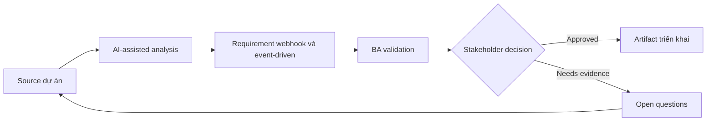

# Requirement webhook và event-driven

<div class="case-meta">
  <span>Backend and API</span>
  <span>Event-driven integration</span>
  <span>Backend/API refinement</span>
  <span>Practitioner</span>
  <span>Event catalog</span>
  <span>Use case dự án</span>
</div>

## Project context

Platform cần notify partner system khi invoice được created, paid, voided hoặc disputed. Partner cần webhook reliable, replay support và event payload rõ. Trong Event-driven integration, công việc này thường bắt đầu khi API contract, permission, error, audit và operational behavior phải đủ explicit cho backend delivery. BA nên xem Entity lifecycle và Partner integration needs là evidence cần organize, không phải raw material để AI trả lời không kiểm soát. Mục tiêu là làm decision tiếp theo rõ hơn cho người own outcome.

## BA challenge

BA phải specify event behavior vượt ngoài việc đặt tên event. Requirement cần cover trigger, payload, ordering, retry, replay, security, subscription management và partner-facing documentation. Với Requirement webhook và event-driven, khó khăn thực tế là service behavior mơ hồ và security gap. AI có thể tăng tốc contract critique, rule extraction, error taxonomy, permission review và NFR gap detection, nhưng BA vẫn phải làm rõ assumption, approval còn thiếu và điểm cần stakeholder judgment.

## Where AI fits

<div class="ba-workbench-panel">
AI phù hợp với use case Backend và API khi được giới hạn vào contract critique, rule extraction, error taxonomy, permission review và NFR gap detection. AI task hữu ích đầu tiên là: Generate event catalog và payload question từ lifecycle state. AI không được approve scope, invent policy, bỏ qua API draft, data model, auth rule, error sample, audit policy và integration need, hoặc biến draft thành final decision.
</div>

- Generate event catalog và payload question từ lifecycle state.
- Identify retry, replay, ordering và duplicate scenario.
- Draft partner documentation requirement.
- Tạo negative và operational test scenario.

## Inputs to prepare

- Entity lifecycle
- Partner integration needs
- Security requirements
- Existing webhook examples
- Operational support process

Trước khi prompt cho Requirement webhook và event-driven, hãy label từng input theo owner, date, approval status, sensitivity và vai trò trong decision. Evidence lens quan trọng nhất là API draft, data model, auth rule, error sample, audit policy và integration need; nếu thiếu, AI có thể xem old note, draft design và approved rule có authority như nhau.

## BA workflow

1. Map entity lifecycle transition tới event trigger.
2. Yêu cầu AI draft event catalog và missing payload field.
3. Define event payload, subscription, authentication, retry, replay và idempotency behavior.
4. Review partner documentation và support need.
5. Viết acceptance criteria cho success, failure, duplicate và replay case.
6. Tạo operational monitoring và incident handling requirement.

Chạy workflow như contract validation trước implementation: bắt đầu với "Map entity lifecycle transition tới event trigger.", sau đó giữ decision log visible khi artifact tiến tới Event catalog. Cách này ngăn suggestion của AI âm thầm trở thành backlog, design, release hoặc operational commitment.

## Diagram



## Deliverables

| Deliverable | Nội dung | Owner | Done signal |
| --- | --- | --- | --- |
| Event catalog | Event, trigger, payload, consumer, business meaning và owner | BA và backend | Event map với lifecycle |
| Webhook behavior spec | Subscription, security, retry, replay, ordering và duplicate handling | Backend | Operational behavior defined |
| Partner documentation outline | Payload example, signing, retry, error handling và support | Developer relations | Partner integrate được |
| Event QA scenarios | Success, retry, replay, duplicate, missing consumer và bad signature | QA | Integration behavior testable |

Hãy xem Event catalog là backend behavior contract do BA own. AI có thể draft structure, nhưng BA phải validate "Event map với lifecycle" có thật sự đúng không, artifact có trace được về evidence không và receiving team có hành động được không.

## Prompt to try

```text
Hãy đóng vai senior Business Analyst hiểu AI. Hỗ trợ tôi áp dụng use case "Requirement webhook và event-driven" vào dự án. Trước hết hỏi source evidence và constraint. Sau đó tạo structured analysis gồm project context, assumption, AI-fit boundary, workflow step, deliverable, risk, control, open question và stakeholder decision. Không tự bịa policy, threshold hoặc approval.
```

## Review checklist

- Entity lifecycle được label owner, date, approval status và sensitivity.
- Event catalog trace được về source evidence và có human owner rõ.
- AI task nằm trong boundary contract critique, rule extraction, error taxonomy, permission review và NFR gap detection và không approve scope hoặc policy.
- Risk "Event ambiguity" có control thực tế: Document business meaning và trigger.
- Open assumption được chuyển thành validation question hoặc stakeholder decision.
- Success metric: Event-driven integration có semantic rõ, reliability behavior và documentation sẵn cho partner.

## Risks and controls

| Rủi ro | Vì sao quan trọng | Control của BA |
| --- | --- | --- |
| Event ambiguity | Consumer có thể interpret event meaning khác nhau | Document business meaning và trigger |
| Duplicate delivery | Partner có thể process cùng event hai lần | Specify event ID và idempotency |
| Replay gap | Partner không recover được sau outage | Define replay và event history |
| Security weakness | Webhook có thể bị spoof | Specify signing và authentication |

Control chính cho risk "Event ambiguity" là human accountability explicit: Document business meaning và trigger. Nếu evidence yếu, output nên tạo validation question hoặc decision item, không phải final requirement.
