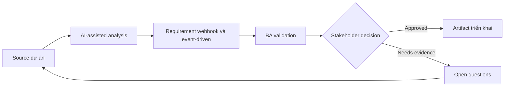

# Requirement webhook và event-driven

<div class="case-meta">
  <span>Backend and API</span>
  <span>Event-driven integration</span>
  <span>Use case dự án</span>
</div>

## Project context

Platform cần notify partner system khi invoice được created, paid, voided hoặc disputed. Partner cần webhook reliable, replay support và event payload rõ. Trong môi trường delivery thật, tình huống này thường xuất hiện dưới áp lực thời gian: stakeholder cần clarity, delivery cần backlog, QA cần behavior test được, operations cần process chịu được exception. BA dùng AI để tăng tốc analysis và synthesis, nhưng BA vẫn chịu trách nhiệm về evidence, business meaning, stakeholder decisioning và artifact quality.

## BA challenge

BA phải specify event behavior vượt ngoài việc đặt tên event. Requirement cần cover trigger, payload, ordering, retry, replay, security, subscription management và partner-facing documentation. Khó khăn thực tế là AI có thể làm material ban đầu trông hoàn chỉnh hơn mức thật sự. BA giỏi giữ output ở trạng thái reviewable bằng cách tách source-backed fact, assumption, unsupported claim, decision gap và recommended next action. Mục tiêu không phải làm document dài hơn; mục tiêu là làm project decision rõ hơn và an toàn hơn.

## Where AI fits

<div class="ba-workbench-panel">
AI hữu ích trong use case này khi được giới hạn vào analysis support, pattern detection, structured drafting và critique. AI không được approve scope, invent policy, quyết định business trade-off hoặc thay thế judgment của stakeholder chịu trách nhiệm.
</div>

- Generate event catalog và payload question từ lifecycle state.
- Identify retry, replay, ordering và duplicate scenario.
- Draft partner documentation requirement.
- Tạo negative và operational test scenario.

## Inputs to prepare

- Entity lifecycle
- Partner integration needs
- Security requirements
- Existing webhook examples
- Operational support process

BA nên label các input này trước khi dùng AI: source owner, source date, approval status, sensitivity level, và source đó là fact, opinion, policy, draft hay historical evidence. Việc chuẩn bị này ngăn model xem mọi input đều current và authoritative như nhau.

## BA workflow

1. Map entity lifecycle transition tới event trigger.
2. Yêu cầu AI draft event catalog và missing payload field.
3. Define event payload, subscription, authentication, retry, replay và idempotency behavior.
4. Review partner documentation và support need.
5. Viết acceptance criteria cho success, failure, duplicate và replay case.
6. Tạo operational monitoring và incident handling requirement.

Workflow hiệu quả nhất khi dùng AI theo từng stage: trước hết organize evidence, sau đó yêu cầu analysis, tiếp theo tạo artifact, rồi chạy critique pass. BA nên giữ decision log visible xuyên suốt để suggestion do AI sinh ra không âm thầm trở thành approved scope.

## Diagram



## Deliverables

| Deliverable | Nội dung | Owner | Done signal |
| --- | --- | --- | --- |
| Event catalog | Event, trigger, payload, consumer, business meaning và owner | BA và backend | Event map với lifecycle |
| Webhook behavior spec | Subscription, security, retry, replay, ordering và duplicate handling | Backend | Operational behavior defined |
| Partner documentation outline | Payload example, signing, retry, error handling và support | Developer relations | Partner integrate được |
| Event QA scenarios | Success, retry, replay, duplicate, missing consumer và bad signature | QA | Integration behavior testable |

Các deliverable này nên được xem là artifact do BA own. AI có thể draft, nhưng BA phải validate source support, stakeholder meaning, traceability và artifact đã sẵn sàng handoff hay chưa.

## Prompt to try

```text
Hãy đóng vai senior Business Analyst hiểu AI. Hỗ trợ tôi áp dụng use case "Requirement webhook và event-driven" vào dự án. Trước hết hỏi source evidence và constraint. Sau đó tạo structured analysis gồm project context, assumption, AI-fit boundary, workflow step, deliverable, risk, control, open question và stakeholder decision. Không tự bịa policy, threshold hoặc approval.
```

## Review checklist

- Mọi statement do AI hỗ trợ đều gắn với source, assumption hoặc validation question.
- BA đã tách drafting assistance khỏi business approval.
- Workflow step có human owner cho decision, review và exception.
- Deliverable trace được về project input và review được bởi QA, product hoặc operations.
- Risk control đủ thực tế để dùng trong meeting dự án thật.
- Success metric: Event-driven integration có semantic rõ, reliability behavior và documentation sẵn cho partner.

## Risks and controls

| Rủi ro | Vì sao quan trọng | Control của BA |
| --- | --- | --- |
| Event ambiguity | Consumer có thể interpret event meaning khác nhau | Document business meaning và trigger |
| Duplicate delivery | Partner có thể process cùng event hai lần | Specify event ID và idempotency |
| Replay gap | Partner không recover được sau outage | Define replay và event history |
| Security weakness | Webhook có thể bị spoof | Specify signing và authentication |

Control quan trọng nhất là làm uncertainty visible. Nếu evidence yếu, output nên tạo validation question hoặc decision item, không phải final requirement. Nếu artifact ảnh hưởng delivery, release, compliance, customer experience hoặc operational workload, BA nên yêu cầu human review explicit trước khi handoff.
